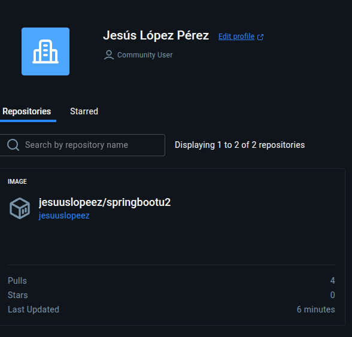
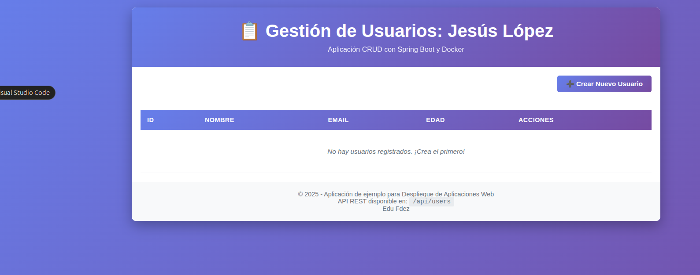
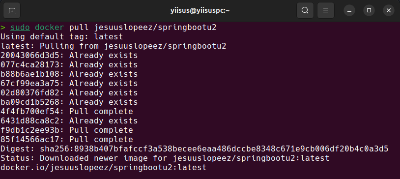

# Documentación actividad GitHub Actions - Docker - Docker Hub - Docker Compose
[Link imagen Docker Hub](https://hub.docker.com/r/jesuuslopeez/springbootu2)

## GitHub Action

He creado un archivo llamado `docker-image.yml` para hacer un flujo con GitHub Actions, el cual se encarga de crear o formar la imagen a partir del Dockerfile y una vez la crea se encarga de pushearla a Docker Hub haciendo uso de *varibles* y *secrets* para que pueda realizar estas acciones por mí de manera segura.

Claramente, este Action lo he sacado de uno ya existente.

Código de `docker-image.yml`:
https://github.com/jesuuslopeez/2526_DAW_u2_springboot/blob/b76ff7609f4050227555efe5b7ef53420e8d892b/.github/workflows/docker-image.yml#L1-L27

Evidencia imagen en Docker Hub:  


```
name: ci

on:
  push:

jobs:
  docker:
    runs-on: ubuntu-latest
    steps:
      -
        name: Login to Docker Hub
        uses: docker/login-action@v3
        with:
          username: ${{ vars.DOCKERHUB_USERNAME }}
          password: ${{ secrets.DOCKERHUB_TOKEN }}
      -
        name: Set up QEMU
        uses: docker/setup-qemu-action@v3
      -
        name: Set up Docker Buildx
        uses: docker/setup-buildx-action@v3
      -
        name: Build and push
        uses: docker/build-push-action@v6
        with:
          push: true
          tags: user/app:latest
```

Únicamente he tenido que cambiar user por mi nombre y app por el nombre de la imagen, a parte de añadir la variable y el secret como mencioné anteriormente.

Estos son sus logs:

```
2025-12-04T08:20:57.3619920Z Current runner version: '2.329.0'
2025-12-04T08:20:57.3643193Z ##[group]Runner Image Provisioner
2025-12-04T08:20:57.3644034Z Hosted Compute Agent
2025-12-04T08:20:57.3644690Z Version: 20251124.448
2025-12-04T08:20:57.3645332Z Commit: fda5086b43ec66ade217e5fcd18146c879571177
2025-12-04T08:20:57.3646015Z Build Date: 2025-11-24T21:16:26Z
2025-12-04T08:20:57.3646694Z ##[endgroup]
2025-12-04T08:20:57.3647222Z ##[group]Operating System
2025-12-04T08:20:57.3647831Z Ubuntu
2025-12-04T08:20:57.3648389Z 24.04.3
2025-12-04T08:20:57.3648833Z LTS
2025-12-04T08:20:57.3649302Z ##[endgroup]
2025-12-04T08:20:57.3649815Z ##[group]Runner Image
2025-12-04T08:20:57.3650447Z Image: ubuntu-24.04
2025-12-04T08:20:57.3650986Z Version: 20251126.144.1
2025-12-04T08:20:57.3652423Z Included Software: https://github.com/actions/runner-images/blob/ubuntu24/20251126.144/images/ubuntu/Ubuntu2404-Readme.md
2025-12-04T08:20:57.3654193Z Image Release: https://github.com/actions/runner-images/releases/tag/ubuntu24%2F20251126.144
2025-12-04T08:20:57.3655254Z ##[endgroup]
2025-12-04T08:20:57.3657821Z ##[group]GITHUB_TOKEN Permissions
2025-12-04T08:20:57.3660081Z Actions: write
2025-12-04T08:20:57.3660702Z ArtifactMetadata: write
2025-12-04T08:20:57.3661361Z Attestations: write
2025-12-04T08:20:57.3661902Z Checks: write
2025-12-04T08:20:57.3662635Z Contents: write
2025-12-04T08:20:57.3663198Z Deployments: write
2025-12-04T08:20:57.3663756Z Discussions: write
2025-12-04T08:20:57.3664306Z Issues: write
2025-12-04T08:20:57.3664783Z Metadata: read
2025-12-04T08:20:57.3665319Z Models: read
2025-12-04T08:20:57.3665853Z Packages: write
2025-12-04T08:20:57.3666340Z Pages: write
2025-12-04T08:20:57.3666926Z PullRequests: write
2025-12-04T08:20:57.3667464Z RepositoryProjects: write
2025-12-04T08:20:57.3668154Z SecurityEvents: write
2025-12-04T08:20:57.3668738Z Statuses: write
2025-12-04T08:20:57.3669245Z ##[endgroup]
2025-12-04T08:20:57.3671267Z Secret source: Actions
2025-12-04T08:20:57.3672228Z Prepare workflow directory
2025-12-04T08:20:57.4039124Z Prepare all required actions
2025-12-04T08:20:57.4076690Z Getting action download info
2025-12-04T08:20:57.8255895Z Download action repository 'docker/login-action@v3' (SHA:5e57cd118135c172c3672efd75eb46360885c0ef)
2025-12-04T08:20:58.8847719Z Download action repository 'docker/setup-qemu-action@v3' (SHA:c7c53464625b32c7a7e944ae62b3e17d2b600130)
2025-12-04T08:20:59.8008893Z Download action repository 'docker/setup-buildx-action@v3' (SHA:e468171a9de216ec08956ac3ada2f0791b6bd435)
2025-12-04T08:21:00.7374243Z Download action repository 'docker/build-push-action@v6' (SHA:263435318d21b8e681c14492fe198d362a7d2c83)
2025-12-04T08:21:01.8060620Z Complete job name: docker
2025-12-04T08:21:01.8670910Z ##[group]Run docker/login-action@v3
2025-12-04T08:21:01.8671477Z with:
2025-12-04T08:21:01.8671674Z   username: jesuuslopeez
2025-12-04T08:21:01.8672568Z   password: ***
2025-12-04T08:21:01.8672785Z   logout: true
2025-12-04T08:21:01.8673249Z ##[endgroup]
2025-12-04T08:21:02.1650140Z Logging into docker.io...
2025-12-04T08:21:02.8291470Z Login Succeeded!
2025-12-04T08:21:02.8469157Z ##[group]Run docker/setup-qemu-action@v3
2025-12-04T08:21:02.8469648Z with:
2025-12-04T08:21:02.8469907Z   image: docker.io/tonistiigi/binfmt:latest
2025-12-04T08:21:02.8470264Z   platforms: all
2025-12-04T08:21:02.8470629Z   cache-image: true
2025-12-04T08:21:02.8470870Z ##[endgroup]
2025-12-04T08:21:03.0755675Z ##[group]Docker info
2025-12-04T08:21:03.0799625Z [command]/usr/bin/docker version
2025-12-04T08:21:03.1004578Z Client: Docker Engine - Community
2025-12-04T08:21:03.1005370Z  Version:           28.0.4
2025-12-04T08:21:03.1005815Z  API version:       1.48
2025-12-04T08:21:03.1006268Z  Go version:        go1.23.7
2025-12-04T08:21:03.1006836Z  Git commit:        b8034c0
2025-12-04T08:21:03.1007347Z  Built:             Tue Mar 25 15:07:16 2025
2025-12-04T08:21:03.1007882Z  OS/Arch:           linux/amd64
2025-12-04T08:21:03.1008463Z  Context:           default
2025-12-04T08:21:03.1008737Z 
2025-12-04T08:21:03.1008962Z Server: Docker Engine - Community
2025-12-04T08:21:03.1010104Z  Engine:
2025-12-04T08:21:03.1010615Z   Version:          28.0.4
2025-12-04T08:21:03.1011207Z   API version:      1.48 (minimum version 1.24)
2025-12-04T08:21:03.1011625Z   Go version:       go1.23.7
2025-12-04T08:21:03.1012288Z   Git commit:       6430e49
2025-12-04T08:21:03.1012635Z   Built:            Tue Mar 25 15:07:16 2025
2025-12-04T08:21:03.1013006Z   OS/Arch:          linux/amd64
2025-12-04T08:21:03.1013382Z   Experimental:     false
2025-12-04T08:21:03.1013643Z  containerd:
2025-12-04T08:21:03.1013951Z   Version:          v2.1.5
2025-12-04T08:21:03.1014391Z   GitCommit:        fcd43222d6b07379a4be9786bda52438f0dd16a1
2025-12-04T08:21:03.1014727Z  runc:
2025-12-04T08:21:03.1015019Z   Version:          1.3.3
2025-12-04T08:21:03.1015381Z   GitCommit:        v1.3.3-0-gd842d771
2025-12-04T08:21:03.1015679Z  docker-init:
2025-12-04T08:21:03.1015988Z   Version:          0.19.0
2025-12-04T08:21:03.1016287Z   GitCommit:        de40ad0
2025-12-04T08:21:03.1049885Z [command]/usr/bin/docker info
2025-12-04T08:21:05.0385513Z Client: Docker Engine - Community
2025-12-04T08:21:05.0386285Z  Version:    28.0.4
2025-12-04T08:21:05.0386890Z  Context:    default
2025-12-04T08:21:05.0387373Z  Debug Mode: false
2025-12-04T08:21:05.0387752Z  Plugins:
2025-12-04T08:21:05.0388316Z   buildx: Docker Buildx (Docker Inc.)
2025-12-04T08:21:05.0388801Z     Version:  v0.30.1
2025-12-04T08:21:05.0389407Z     Path:     /usr/libexec/docker/cli-plugins/docker-buildx
2025-12-04T08:21:05.0390138Z   compose: Docker Compose (Docker Inc.)
2025-12-04T08:21:05.0390622Z     Version:  v2.38.2
2025-12-04T08:21:05.0391189Z     Path:     /usr/libexec/docker/cli-plugins/docker-compose
2025-12-04T08:21:05.0391678Z 
2025-12-04T08:21:05.0392122Z Server:
2025-12-04T08:21:05.0392489Z  Containers: 0
2025-12-04T08:21:05.0392895Z   Running: 0
2025-12-04T08:21:05.0394014Z   Paused: 0
2025-12-04T08:21:05.0394508Z   Stopped: 0
2025-12-04T08:21:05.0394957Z  Images: 0
2025-12-04T08:21:05.0395531Z  Server Version: 28.0.4
2025-12-04T08:21:05.0396105Z  Storage Driver: overlay2
2025-12-04T08:21:05.0396583Z   Backing Filesystem: extfs
2025-12-04T08:21:05.0397238Z   Supports d_type: true
2025-12-04T08:21:05.0397779Z   Using metacopy: false
2025-12-04T08:21:05.0398265Z   Native Overlay Diff: false
2025-12-04T08:21:05.0399004Z   userxattr: false
2025-12-04T08:21:05.0399514Z  Logging Driver: json-file
2025-12-04T08:21:05.0400085Z  Cgroup Driver: systemd
2025-12-04T08:21:05.0400809Z  Cgroup Version: 2
2025-12-04T08:21:05.0401255Z  Plugins:
2025-12-04T08:21:05.0401798Z   Volume: local
2025-12-04T08:21:05.0402787Z   Network: bridge host ipvlan macvlan null overlay
2025-12-04T08:21:05.0403651Z   Log: awslogs fluentd gcplogs gelf journald json-file local splunk syslog
2025-12-04T08:21:05.0404411Z  Swarm: inactive
2025-12-04T08:21:05.0405067Z  Runtimes: io.containerd.runc.v2 runc
2025-12-04T08:21:05.0405656Z  Default Runtime: runc
2025-12-04T08:21:05.0406195Z  Init Binary: docker-init
2025-12-04T08:21:05.0406939Z  containerd version: fcd43222d6b07379a4be9786bda52438f0dd16a1
2025-12-04T08:21:05.0408111Z  runc version: v1.3.3-0-gd842d771
2025-12-04T08:21:05.0408703Z  init version: de40ad0
2025-12-04T08:21:05.0409211Z  Security Options:
2025-12-04T08:21:05.0409712Z   apparmor
2025-12-04T08:21:05.0410096Z   seccomp
2025-12-04T08:21:05.0410632Z    Profile: builtin
2025-12-04T08:21:05.0411107Z   cgroupns
2025-12-04T08:21:05.0411504Z  Kernel Version: 6.11.0-1018-azure
2025-12-04T08:21:05.0412353Z  Operating System: Ubuntu 24.04.3 LTS
2025-12-04T08:21:05.0412950Z  OSType: linux
2025-12-04T08:21:05.0413419Z  Architecture: x86_64
2025-12-04T08:21:05.0413953Z  CPUs: 4
2025-12-04T08:21:05.0414369Z  Total Memory: 15.62GiB
2025-12-04T08:21:05.0414885Z  Name: runnervmoqczp
2025-12-04T08:21:05.0415499Z  ID: 4ce6fa60-2f23-4ac2-b56a-0440c85af90a
2025-12-04T08:21:05.0416102Z  Docker Root Dir: /var/lib/docker
2025-12-04T08:21:05.0416713Z  Debug Mode: false
2025-12-04T08:21:05.0417140Z  Username: jesuuslopeez
2025-12-04T08:21:05.0417821Z  Experimental: false
2025-12-04T08:21:05.0418659Z  Insecure Registries:
2025-12-04T08:21:05.0424128Z   ::1/128
2025-12-04T08:21:05.0424543Z   127.0.0.0/8
2025-12-04T08:21:05.0424805Z  Live Restore Enabled: false
2025-12-04T08:21:05.0425042Z 
2025-12-04T08:21:05.0425779Z ##[endgroup]
2025-12-04T08:21:05.0426284Z ##[group]Pulling binfmt Docker image
2025-12-04T08:21:05.3448547Z Cache hit for: docker.io--tonistiigi--binfmt-latest-linux-x64
2025-12-04T08:21:06.5754791Z Received 23282336 of 31670944 (73.5%), 22.2 MBs/sec
2025-12-04T08:21:06.6674091Z Received 31670944 of 31670944 (100.0%), 27.7 MBs/sec
2025-12-04T08:21:06.6676977Z Cache Size: ~30 MB (31670944 B)
2025-12-04T08:21:06.6705414Z [command]/usr/bin/tar -xf /home/runner/work/_temp/fa4af784-3e5f-44b5-8775-81862ae774fb/cache.tzst -P -C /home/runner/work/2526_DAW_u2_springboot/2526_DAW_u2_springboot --use-compress-program unzstd
2025-12-04T08:21:06.8090942Z Cache restored successfully
2025-12-04T08:21:06.8154216Z Restored docker.io--tonistiigi--binfmt-latest-linux-x64 from GitHub Actions cache
2025-12-04T08:21:06.8906705Z Cached to hosted tool cache /opt/hostedtoolcache/docker.io--tonistiigi--binfmt/latest/linux-x64
2025-12-04T08:21:06.8908420Z Copying /opt/hostedtoolcache/docker.io--tonistiigi--binfmt/latest/linux-x64/image.tar to /home/runner/.docker/.cache/images/docker.io--tonistiigi--binfmt/latest/linux-x64/image.tar
2025-12-04T08:21:06.9820798Z Image found from cache in /home/runner/.docker/.cache/images/docker.io--tonistiigi--binfmt/latest/linux-x64/image.tar
2025-12-04T08:21:06.9842117Z [command]/usr/bin/docker load -i /home/runner/.docker/.cache/images/docker.io--tonistiigi--binfmt/latest/linux-x64/image.tar
2025-12-04T08:21:08.2307003Z Loaded image: tonistiigi/binfmt:latest
2025-12-04T08:21:08.2480303Z [command]/usr/bin/docker pull docker.io/tonistiigi/binfmt:latest
2025-12-04T08:21:09.0318131Z latest: Pulling from tonistiigi/binfmt
2025-12-04T08:21:09.2464975Z Digest: sha256:30cc9a4d03765acac9be2ed0afc23af1ad018aed2c28ea4be8c2eb9afe03fbd1
2025-12-04T08:21:09.2471091Z Status: Image is up to date for tonistiigi/binfmt:latest
2025-12-04T08:21:09.2480756Z docker.io/tonistiigi/binfmt:latest
2025-12-04T08:21:09.2521487Z [command]/usr/bin/docker save -o /home/runner/work/_temp/docker-actions-toolkit-LGx3Rs/749e64100d3fa0c09bdbc8a02e4fb9cb3ee64266f7f661c98371040689abacb3.tar docker.io/tonistiigi/binfmt:latest
2025-12-04T08:21:09.6509969Z Copying /home/runner/work/_temp/docker-actions-toolkit-LGx3Rs/749e64100d3fa0c09bdbc8a02e4fb9cb3ee64266f7f661c98371040689abacb3.tar to /home/runner/.docker/.cache/images/docker.io--tonistiigi--binfmt/latest/linux-x64/image.tar
2025-12-04T08:21:09.8148765Z Image cached to /home/runner/.docker/.cache/images/docker.io--tonistiigi--binfmt/latest/linux-x64/image.tar
2025-12-04T08:21:09.8150187Z ##[endgroup]
2025-12-04T08:21:09.8151261Z ##[group]Image info
2025-12-04T08:21:09.8169199Z [command]/usr/bin/docker image inspect docker.io/tonistiigi/binfmt:latest
2025-12-04T08:21:09.8309749Z [
2025-12-04T08:21:09.8310821Z     {
2025-12-04T08:21:09.8312528Z         "Id": "sha256:c97f15e717f7eb99d237e46f0a3553da8cfdf470a15bba459c056d90d0e398f5",
2025-12-04T08:21:09.8397858Z         "RepoTags": [
2025-12-04T08:21:09.8398412Z             "tonistiigi/binfmt:latest"
2025-12-04T08:21:09.8398831Z         ],
2025-12-04T08:21:09.8399132Z         "RepoDigests": [
2025-12-04T08:21:09.8399847Z             "tonistiigi/binfmt@sha256:30cc9a4d03765acac9be2ed0afc23af1ad018aed2c28ea4be8c2eb9afe03fbd1"
2025-12-04T08:21:09.8400593Z         ],
2025-12-04T08:21:09.8400888Z         "Parent": "",
2025-12-04T08:21:09.8401280Z         "Comment": "buildkit.dockerfile.v0",
2025-12-04T08:21:09.8401754Z         "Created": "2025-09-11T09:43:57.050886711Z",
2025-12-04T08:21:09.8402326Z         "DockerVersion": "",
2025-12-04T08:21:09.8402697Z         "Author": "",
2025-12-04T08:21:09.8403024Z         "Config": {
2025-12-04T08:21:09.8403355Z             "Hostname": "",
2025-12-04T08:21:09.8403708Z             "Domainname": "",
2025-12-04T08:21:09.8404071Z             "User": "",
2025-12-04T08:21:09.8404410Z             "AttachStdin": false,
2025-12-04T08:21:09.8405094Z             "AttachStdout": false,
2025-12-04T08:21:09.8405485Z             "AttachStderr": false,
2025-12-04T08:21:09.8405874Z             "Tty": false,
2025-12-04T08:21:09.8406226Z             "OpenStdin": false,
2025-12-04T08:21:09.8406611Z             "StdinOnce": false,
2025-12-04T08:21:09.8406955Z             "Env": [
2025-12-04T08:21:09.8407468Z                 "PATH=/usr/local/sbin:/usr/local/bin:/usr/sbin:/usr/bin:/sbin:/bin",
2025-12-04T08:21:09.8408083Z                 "QEMU_PRESERVE_ARGV0=1"
2025-12-04T08:21:09.8408512Z             ],
2025-12-04T08:21:09.8408835Z             "Cmd": null,
2025-12-04T08:21:09.8409221Z             "Image": "",
2025-12-04T08:21:09.8409583Z             "Volumes": {
2025-12-04T08:21:09.8409929Z                 "/tmp": {}
2025-12-04T08:21:09.8410263Z             },
2025-12-04T08:21:09.8410562Z             "WorkingDir": "/",
2025-12-04T08:21:09.8410937Z             "Entrypoint": [
2025-12-04T08:21:09.8411314Z                 "/usr/bin/binfmt"
2025-12-04T08:21:09.8411695Z             ],
2025-12-04T08:21:09.8412166Z             "OnBuild": null,
2025-12-04T08:21:09.8412528Z             "Labels": {
2025-12-04T08:21:09.8413016Z                 "org.opencontainers.image.created": "2025-09-11T09:13:47.128Z",
2025-12-04T08:21:09.8414011Z                 "org.opencontainers.image.description": "Cross-platform emulator collection distributed with Docker images",
2025-12-04T08:21:09.8414970Z                 "org.opencontainers.image.licenses": "MIT",
2025-12-04T08:21:09.8415728Z                 "org.opencontainers.image.revision": "8bf932dba1f67bb274320e7cebece2807e4b99e1",
2025-12-04T08:21:09.8416704Z                 "org.opencontainers.image.source": "https://github.com/tonistiigi/binfmt",
2025-12-04T08:21:09.8417481Z                 "org.opencontainers.image.title": "Binfmt",
2025-12-04T08:21:09.8418169Z                 "org.opencontainers.image.url": "https://github.com/tonistiigi/binfmt",
2025-12-04T08:21:09.8418911Z                 "org.opencontainers.image.version": "qemu-v10.0.4-56"
2025-12-04T08:21:09.8419376Z             }
2025-12-04T08:21:09.8419558Z         },
2025-12-04T08:21:09.8419740Z         "Architecture": "amd64",
2025-12-04T08:21:09.8420095Z         "Os": "linux",
2025-12-04T08:21:09.8420390Z         "Size": 83325873,
2025-12-04T08:21:09.8420596Z         "GraphDriver": {
2025-12-04T08:21:09.8420905Z             "Data": {
2025-12-04T08:21:09.8421424Z                 "LowerDir": "/var/lib/docker/overlay2/4f4b28749311aa60cb846ddcb09cf1599a93d0709f957a5d6294471c0704bce1/diff",
2025-12-04T08:21:09.8422602Z                 "MergedDir": "/var/lib/docker/overlay2/7452b28388859a0ed468ce5ad9e1b17e72f8c09c5dc8c3d45f0a73abe3e60222/merged",
2025-12-04T08:21:09.8423905Z                 "UpperDir": "/var/lib/docker/overlay2/7452b28388859a0ed468ce5ad9e1b17e72f8c09c5dc8c3d45f0a73abe3e60222/diff",
2025-12-04T08:21:09.8424863Z                 "WorkDir": "/var/lib/docker/overlay2/7452b28388859a0ed468ce5ad9e1b17e72f8c09c5dc8c3d45f0a73abe3e60222/work"
2025-12-04T08:21:09.8425620Z             },
2025-12-04T08:21:09.8425841Z             "Name": "overlay2"
2025-12-04T08:21:09.8426060Z         },
2025-12-04T08:21:09.8426346Z         "RootFS": {
2025-12-04T08:21:09.8426588Z             "Type": "layers",
2025-12-04T08:21:09.8426797Z             "Layers": [
2025-12-04T08:21:09.8427233Z                 "sha256:ba63059928005ec5a66585f9353d2f4e14eaede3da6a25acac0a4f44d809cb64",
2025-12-04T08:21:09.8427740Z                 "sha256:66aa431c2e5b0cb36e6f7fde44ab8195fab52d6c93b407c720212e28337ac745"
2025-12-04T08:21:09.8428198Z             ]
2025-12-04T08:21:09.8428363Z         },
2025-12-04T08:21:09.8428533Z         "Metadata": {
2025-12-04T08:21:09.8428840Z             "LastTagTime": "0001-01-01T00:00:00Z"
2025-12-04T08:21:09.8429086Z         }
2025-12-04T08:21:09.8429244Z     }
2025-12-04T08:21:09.8429441Z ]
2025-12-04T08:21:09.8430014Z ##[endgroup]
2025-12-04T08:21:09.8430529Z ##[group]Binfmt version
2025-12-04T08:21:09.8431200Z [command]/usr/bin/docker run --rm --privileged docker.io/tonistiigi/binfmt:latest --version
2025-12-04T08:21:10.2481088Z binfmt/8bf932d qemu/v10.0.4 go/1.23.12
2025-12-04T08:21:10.3217827Z ##[endgroup]
2025-12-04T08:21:10.3218388Z ##[group]Installing QEMU static binaries
2025-12-04T08:21:10.3235642Z [command]/usr/bin/docker run --rm --privileged docker.io/tonistiigi/binfmt:latest --install all
2025-12-04T08:21:10.4932622Z installing: riscv64 OK
2025-12-04T08:21:10.4933109Z installing: mips64le OK
2025-12-04T08:21:10.4933537Z installing: loong64 OK
2025-12-04T08:21:10.4933960Z installing: ppc64le OK
2025-12-04T08:21:10.4934369Z installing: s390x OK
2025-12-04T08:21:10.4934758Z installing: mips64 OK
2025-12-04T08:21:10.4935154Z installing: arm64 OK
2025-12-04T08:21:10.4935489Z installing: arm OK
2025-12-04T08:21:10.5171290Z {
2025-12-04T08:21:10.5171760Z   "supported": [
2025-12-04T08:21:10.5175629Z     "linux/amd64",
2025-12-04T08:21:10.5175947Z     "linux/amd64/v2",
2025-12-04T08:21:10.5176263Z     "linux/amd64/v3",
2025-12-04T08:21:10.5176613Z     "linux/arm64",
2025-12-04T08:21:10.5176926Z     "linux/riscv64",
2025-12-04T08:21:10.5177251Z     "linux/ppc64le",
2025-12-04T08:21:10.5177577Z     "linux/s390x",
2025-12-04T08:21:10.5177874Z     "linux/386",
2025-12-04T08:21:10.5178184Z     "linux/mips64le",
2025-12-04T08:21:10.5178515Z     "linux/mips64",
2025-12-04T08:21:10.5178801Z     "linux/loong64",
2025-12-04T08:21:10.5179157Z     "linux/arm/v7",
2025-12-04T08:21:10.5179444Z     "linux/arm/v6"
2025-12-04T08:21:10.5179732Z   ],
2025-12-04T08:21:10.5179992Z   "emulators": [
2025-12-04T08:21:10.5180312Z     "llvm-16-runtime.binfmt",
2025-12-04T08:21:10.5180704Z     "llvm-17-runtime.binfmt",
2025-12-04T08:21:10.5181085Z     "llvm-18-runtime.binfmt",
2025-12-04T08:21:10.5181456Z     "python3.12",
2025-12-04T08:21:10.5181762Z     "qemu-aarch64",
2025-12-04T08:21:10.5182284Z     "qemu-arm",
2025-12-04T08:21:10.5182603Z     "qemu-loongarch64",
2025-12-04T08:21:10.5182940Z     "qemu-mips64",
2025-12-04T08:21:10.5183249Z     "qemu-mips64el",
2025-12-04T08:21:10.5183604Z     "qemu-ppc64le",
2025-12-04T08:21:10.5183922Z     "qemu-riscv64",
2025-12-04T08:21:10.5184223Z     "qemu-s390x"
2025-12-04T08:21:10.5184523Z   ]
2025-12-04T08:21:10.5184781Z }
2025-12-04T08:21:10.5813826Z ##[endgroup]
2025-12-04T08:21:10.5814233Z ##[group]Extracting available platforms
2025-12-04T08:21:10.8481903Z linux/amd64,linux/amd64/v2,linux/amd64/v3,linux/arm64,linux/riscv64,linux/ppc64le,linux/s390x,linux/386,linux/mips64le,linux/mips64,linux/loong64,linux/arm/v7,linux/arm/v6
2025-12-04T08:21:10.8484219Z ##[endgroup]
2025-12-04T08:21:10.8667266Z ##[group]Run docker/setup-buildx-action@v3
2025-12-04T08:21:10.8667553Z with:
2025-12-04T08:21:10.8667737Z   driver: docker-container
2025-12-04T08:21:10.8667948Z   install: false
2025-12-04T08:21:10.8668121Z   use: true
2025-12-04T08:21:10.8668291Z   keep-state: false
2025-12-04T08:21:10.8668493Z   cache-binary: true
2025-12-04T08:21:10.8668685Z   cleanup: true
2025-12-04T08:21:10.8668857Z ##[endgroup]
2025-12-04T08:21:11.1456949Z ##[group]Docker info
2025-12-04T08:21:11.1478250Z [command]/usr/bin/docker version
2025-12-04T08:21:11.1657477Z Client: Docker Engine - Community
2025-12-04T08:21:11.1657937Z  Version:           28.0.4
2025-12-04T08:21:11.1660445Z  API version:       1.48
2025-12-04T08:21:11.1660837Z  Go version:        go1.23.7
2025-12-04T08:21:11.1661199Z  Git commit:        b8034c0
2025-12-04T08:21:11.1661572Z  Built:             Tue Mar 25 15:07:16 2025
2025-12-04T08:21:11.1662162Z  OS/Arch:           linux/amd64
2025-12-04T08:21:11.1662615Z  Context:           default
2025-12-04T08:21:11.1662838Z 
2025-12-04T08:21:11.1662992Z Server: Docker Engine - Community
2025-12-04T08:21:11.1663362Z  Engine:
2025-12-04T08:21:11.1663642Z   Version:          28.0.4
2025-12-04T08:21:11.1664030Z   API version:      1.48 (minimum version 1.24)
2025-12-04T08:21:11.1664466Z   Go version:       go1.23.7
2025-12-04T08:21:11.1664813Z   Git commit:       6430e49
2025-12-04T08:21:11.1665102Z   Built:            Tue Mar 25 15:07:16 2025
2025-12-04T08:21:11.1665674Z   OS/Arch:          linux/amd64
2025-12-04T08:21:11.1665912Z   Experimental:     false
2025-12-04T08:21:11.1666118Z  containerd:
2025-12-04T08:21:11.1666303Z   Version:          v2.1.5
2025-12-04T08:21:11.1666571Z   GitCommit:        fcd43222d6b07379a4be9786bda52438f0dd16a1
2025-12-04T08:21:11.1666856Z  runc:
2025-12-04T08:21:11.1667015Z   Version:          1.3.3
2025-12-04T08:21:11.1667227Z   GitCommit:        v1.3.3-0-gd842d771
2025-12-04T08:21:11.1667472Z  docker-init:
2025-12-04T08:21:11.1667719Z   Version:          0.19.0
2025-12-04T08:21:11.1668096Z   GitCommit:        de40ad0
2025-12-04T08:21:11.1709618Z [command]/usr/bin/docker info
2025-12-04T08:21:11.2279588Z Client: Docker Engine - Community
2025-12-04T08:21:11.2280060Z  Version:    28.0.4
2025-12-04T08:21:11.2280380Z  Context:    default
2025-12-04T08:21:11.2280712Z  Debug Mode: false
2025-12-04T08:21:11.2281008Z  Plugins:
2025-12-04T08:21:11.2281308Z   buildx: Docker Buildx (Docker Inc.)
2025-12-04T08:21:11.2281616Z     Version:  v0.30.1
2025-12-04T08:21:11.2281908Z     Path:     /usr/libexec/docker/cli-plugins/docker-buildx
2025-12-04T08:21:11.2282492Z   compose: Docker Compose (Docker Inc.)
2025-12-04T08:21:11.2282748Z     Version:  v2.38.2
2025-12-04T08:21:11.2283010Z     Path:     /usr/libexec/docker/cli-plugins/docker-compose
2025-12-04T08:21:11.2283273Z 
2025-12-04T08:21:11.2283339Z Server:
2025-12-04T08:21:11.2283504Z  Containers: 0
2025-12-04T08:21:11.2283672Z   Running: 0
2025-12-04T08:21:11.2283837Z   Paused: 0
2025-12-04T08:21:11.2283997Z   Stopped: 0
2025-12-04T08:21:11.2284172Z  Images: 1
2025-12-04T08:21:11.2284334Z  Server Version: 28.0.4
2025-12-04T08:21:11.2284539Z  Storage Driver: overlay2
2025-12-04T08:21:11.2284751Z   Backing Filesystem: extfs
2025-12-04T08:21:11.2284968Z   Supports d_type: true
2025-12-04T08:21:11.2285159Z   Using metacopy: false
2025-12-04T08:21:11.2285382Z   Native Overlay Diff: false
2025-12-04T08:21:11.2285596Z   userxattr: false
2025-12-04T08:21:11.2285783Z  Logging Driver: json-file
2025-12-04T08:21:11.2285990Z  Cgroup Driver: systemd
2025-12-04T08:21:11.2286187Z  Cgroup Version: 2
2025-12-04T08:21:11.2286367Z  Plugins:
2025-12-04T08:21:11.2286533Z   Volume: local
2025-12-04T08:21:11.2286756Z   Network: bridge host ipvlan macvlan null overlay
2025-12-04T08:21:11.2287146Z   Log: awslogs fluentd gcplogs gelf journald json-file local splunk syslog
2025-12-04T08:21:11.2287478Z  Swarm: inactive
2025-12-04T08:21:11.2287678Z  Runtimes: runc io.containerd.runc.v2
2025-12-04T08:21:11.2287924Z  Default Runtime: runc
2025-12-04T08:21:11.2288408Z  Init Binary: docker-init
2025-12-04T08:21:11.2288689Z  containerd version: fcd43222d6b07379a4be9786bda52438f0dd16a1
2025-12-04T08:21:11.2288999Z  runc version: v1.3.3-0-gd842d771
2025-12-04T08:21:11.2289229Z  init version: de40ad0
2025-12-04T08:21:11.2289416Z  Security Options:
2025-12-04T08:21:11.2289588Z   apparmor
2025-12-04T08:21:11.2289748Z   seccomp
2025-12-04T08:21:11.2289908Z    Profile: builtin
2025-12-04T08:21:11.2290086Z   cgroupns
2025-12-04T08:21:11.2290257Z  Kernel Version: 6.11.0-1018-azure
2025-12-04T08:21:11.2290496Z  Operating System: Ubuntu 24.04.3 LTS
2025-12-04T08:21:11.2290724Z  OSType: linux
2025-12-04T08:21:11.2290896Z  Architecture: x86_64
2025-12-04T08:21:11.2291084Z  CPUs: 4
2025-12-04T08:21:11.2291246Z  Total Memory: 15.62GiB
2025-12-04T08:21:11.2291442Z  Name: runnervmoqczp
2025-12-04T08:21:11.2291745Z  ID: 4ce6fa60-2f23-4ac2-b56a-0440c85af90a
2025-12-04T08:21:11.2292359Z  Docker Root Dir: /var/lib/docker
2025-12-04T08:21:11.2292770Z  Debug Mode: false
2025-12-04T08:21:11.2293116Z  Username: jesuuslopeez
2025-12-04T08:21:11.2293472Z  Experimental: false
2025-12-04T08:21:11.2293835Z  Insecure Registries:
2025-12-04T08:21:11.2294221Z   ::1/128
2025-12-04T08:21:11.2294508Z   127.0.0.0/8
2025-12-04T08:21:11.2294825Z  Live Restore Enabled: false
2025-12-04T08:21:11.2295095Z 
2025-12-04T08:21:11.2298296Z ##[endgroup]
2025-12-04T08:21:11.3256956Z ##[group]Buildx version
2025-12-04T08:21:11.3280231Z [command]/usr/bin/docker buildx version
2025-12-04T08:21:11.4079904Z github.com/docker/buildx v0.30.1 9e66234aa13328a5e75b75aa5574e1ca6d6d9c01
2025-12-04T08:21:11.4115183Z ##[endgroup]
2025-12-04T08:21:11.4269953Z ##[group]Inspecting default docker context
2025-12-04T08:21:11.4426460Z [
2025-12-04T08:21:11.4426805Z   {
2025-12-04T08:21:11.4427084Z     "Name": "default",
2025-12-04T08:21:11.4427531Z     "Metadata": {},
2025-12-04T08:21:11.4427868Z     "Endpoints": {
2025-12-04T08:21:11.4428191Z       "docker": {
2025-12-04T08:21:11.4428563Z         "Host": "unix:///var/run/docker.sock",
2025-12-04T08:21:11.4429071Z         "SkipTLSVerify": false
2025-12-04T08:21:11.4429460Z       }
2025-12-04T08:21:11.4429840Z     },
2025-12-04T08:21:11.4430144Z     "TLSMaterial": {},
2025-12-04T08:21:11.4430506Z     "Storage": {
2025-12-04T08:21:11.4430852Z       "MetadataPath": "<IN MEMORY>",
2025-12-04T08:21:11.4431316Z       "TLSPath": "<IN MEMORY>"
2025-12-04T08:21:11.4431708Z     }
2025-12-04T08:21:11.4432168Z   }
2025-12-04T08:21:11.4432463Z ]
2025-12-04T08:21:11.4442954Z ##[endgroup]
2025-12-04T08:21:11.4443588Z ##[group]Creating a new builder instance
2025-12-04T08:21:11.6038907Z [command]/usr/bin/docker buildx create --name builder-6c418465-485e-43ac-b9cc-8d6ccd4c630f --driver docker-container --buildkitd-flags --allow-insecure-entitlement security.insecure --allow-insecure-entitlement network.host --use
2025-12-04T08:21:11.6961450Z builder-6c418465-485e-43ac-b9cc-8d6ccd4c630f
2025-12-04T08:21:11.6997219Z ##[endgroup]
2025-12-04T08:21:11.6997833Z ##[group]Booting builder
2025-12-04T08:21:11.7028026Z [command]/usr/bin/docker buildx inspect --bootstrap --builder builder-6c418465-485e-43ac-b9cc-8d6ccd4c630f
2025-12-04T08:21:11.7535479Z #1 [internal] booting buildkit
2025-12-04T08:21:11.9040215Z #1 pulling image moby/buildkit:buildx-stable-1
2025-12-04T08:21:14.8859925Z #1 pulling image moby/buildkit:buildx-stable-1 3.1s done
2025-12-04T08:21:15.0371288Z #1 creating container buildx_buildkit_builder-6c418465-485e-43ac-b9cc-8d6ccd4c630f0
2025-12-04T08:21:15.2616200Z #1 creating container buildx_buildkit_builder-6c418465-485e-43ac-b9cc-8d6ccd4c630f0 0.4s done
2025-12-04T08:21:15.2630883Z #1 DONE 3.5s
2025-12-04T08:21:15.2956120Z Name:          builder-6c418465-485e-43ac-b9cc-8d6ccd4c630f
2025-12-04T08:21:15.2957656Z Driver:        docker-container
2025-12-04T08:21:15.2958091Z Last Activity: 2025-12-04 08:21:11 +0000 UTC
2025-12-04T08:21:15.2958403Z 
2025-12-04T08:21:15.2959118Z Nodes:
2025-12-04T08:21:15.2959564Z Name:                  builder-6c418465-485e-43ac-b9cc-8d6ccd4c630f0
2025-12-04T08:21:15.2960528Z Endpoint:              unix:///var/run/docker.sock
2025-12-04T08:21:15.2961005Z Status:                running
2025-12-04T08:21:15.2961808Z BuildKit daemon flags: --allow-insecure-entitlement security.insecure --allow-insecure-entitlement network.host
2025-12-04T08:21:15.2962877Z BuildKit version:      v0.26.2
2025-12-04T08:21:15.2964096Z Platforms:             linux/amd64, linux/amd64/v2, linux/amd64/v3, linux/arm64, linux/riscv64, linux/ppc64le, linux/s390x, linux/386, linux/mips64le, linux/mips64, linux/loong64, linux/arm/v7, linux/arm/v6
2025-12-04T08:21:15.2965303Z Labels:
2025-12-04T08:21:15.2965680Z  org.mobyproject.buildkit.worker.executor:         oci
2025-12-04T08:21:15.2966327Z  org.mobyproject.buildkit.worker.hostname:         47d8e7aa7191
2025-12-04T08:21:15.2966980Z  org.mobyproject.buildkit.worker.network:          host
2025-12-04T08:21:15.2967615Z  org.mobyproject.buildkit.worker.oci.process-mode: sandbox
2025-12-04T08:21:15.2968285Z  org.mobyproject.buildkit.worker.selinux.enabled:  false
2025-12-04T08:21:15.2968949Z  org.mobyproject.buildkit.worker.snapshotter:      overlayfs
2025-12-04T08:21:15.2969480Z GC Policy rule#0:
2025-12-04T08:21:15.2969788Z  All:            false
2025-12-04T08:21:15.2970322Z  Filters:        type==source.local,type==exec.cachemount,type==source.git.checkout
2025-12-04T08:21:15.2970936Z  Keep Duration:  48h0m0s
2025-12-04T08:21:15.2971278Z  Max Used Space: 488.3MiB
2025-12-04T08:21:15.2971613Z GC Policy rule#1:
2025-12-04T08:21:15.2972278Z  All:            false
2025-12-04T08:21:15.2972590Z  Keep Duration:  1440h0m0s
2025-12-04T08:21:15.2972939Z  Reserved Space: 7.451GiB
2025-12-04T08:21:15.2973274Z  Max Used Space: 54.02GiB
2025-12-04T08:21:15.2973601Z  Min Free Space: 13.97GiB
2025-12-04T08:21:15.2973922Z GC Policy rule#2:
2025-12-04T08:21:15.2974218Z  All:            false
2025-12-04T08:21:15.2974530Z  Reserved Space: 7.451GiB
2025-12-04T08:21:15.2974857Z  Max Used Space: 54.02GiB
2025-12-04T08:21:15.2975183Z  Min Free Space: 13.97GiB
2025-12-04T08:21:15.2975523Z GC Policy rule#3:
2025-12-04T08:21:15.2975812Z  All:            true
2025-12-04T08:21:15.2976131Z  Reserved Space: 7.451GiB
2025-12-04T08:21:15.2976471Z  Max Used Space: 54.02GiB
2025-12-04T08:21:15.2976825Z  Min Free Space: 13.97GiB
2025-12-04T08:21:15.3014702Z ##[endgroup]
2025-12-04T08:21:15.3918179Z ##[group]Inspect builder
2025-12-04T08:21:15.3921286Z {
2025-12-04T08:21:15.3921568Z   "nodes": [
2025-12-04T08:21:15.3921838Z     {
2025-12-04T08:21:15.3922405Z       "name": "builder-6c418465-485e-43ac-b9cc-8d6ccd4c630f0",
2025-12-04T08:21:15.3922989Z       "endpoint": "unix:///var/run/docker.sock",
2025-12-04T08:21:15.3923429Z       "status": "running",
2025-12-04T08:21:15.3923971Z       "buildkitd-flags": "--allow-insecure-entitlement security.insecure --allow-insecure-entitlement network.host",
2025-12-04T08:21:15.3924542Z       "buildkit": "v0.26.2",
2025-12-04T08:21:15.3925702Z       "platforms": "linux/amd64,linux/amd64/v2,linux/amd64/v3,linux/arm64,linux/riscv64,linux/ppc64le,linux/s390x,linux/386,linux/mips64le,linux/mips64,linux/loong64,linux/arm/v7,linux/arm/v6",
2025-12-04T08:21:15.3926777Z       "features": {
2025-12-04T08:21:15.3927062Z         "Automatically load images to the Docker Engine image store": true,
2025-12-04T08:21:15.3927471Z         "Cache export": true,
2025-12-04T08:21:15.3927851Z         "Direct push": true,
2025-12-04T08:21:15.3928215Z         "Docker exporter": true,
2025-12-04T08:21:15.3928516Z         "Multi-platform build": true,
2025-12-04T08:21:15.3928769Z         "OCI exporter": true
2025-12-04T08:21:15.3928967Z       },
2025-12-04T08:21:15.3929126Z       "labels": {
2025-12-04T08:21:15.3929367Z         "org.mobyproject.buildkit.worker.executor": "oci",
2025-12-04T08:21:15.3929739Z         "org.mobyproject.buildkit.worker.hostname": "47d8e7aa7191",
2025-12-04T08:21:15.3930128Z         "org.mobyproject.buildkit.worker.network": "host",
2025-12-04T08:21:15.3930514Z         "org.mobyproject.buildkit.worker.oci.process-mode": "sandbox",
2025-12-04T08:21:15.3931169Z         "org.mobyproject.buildkit.worker.selinux.enabled": "false",
2025-12-04T08:21:15.3931571Z         "org.mobyproject.buildkit.worker.snapshotter": "overlayfs"
2025-12-04T08:21:15.3931873Z       },
2025-12-04T08:21:15.3932382Z       "gcPolicy": [
2025-12-04T08:21:15.3932568Z         {
2025-12-04T08:21:15.3932727Z           "all": false,
2025-12-04T08:21:15.3932922Z           "filter": [
2025-12-04T08:21:15.3933120Z             "type==source.local",
2025-12-04T08:21:15.3933358Z             "type==exec.cachemount",
2025-12-04T08:21:15.3933606Z             "type==source.git.checkout"
2025-12-04T08:21:15.3933844Z           ],
2025-12-04T08:21:15.3934028Z           "keepDuration": "48h0m0s",
2025-12-04T08:21:15.3934260Z           "maxUsedSpace": "488.3MiB"
2025-12-04T08:21:15.3934468Z         },
2025-12-04T08:21:15.3934629Z         {
2025-12-04T08:21:15.3934794Z           "all": false,
2025-12-04T08:21:15.3935007Z           "keepDuration": "1440h0m0s",
2025-12-04T08:21:15.3935249Z           "reservedSpace": "7.451GiB",
2025-12-04T08:21:15.3935499Z           "maxUsedSpace": "54.02GiB",
2025-12-04T08:21:15.3935739Z           "minFreeSpace": "13.97GiB"
2025-12-04T08:21:15.3935961Z         },
2025-12-04T08:21:15.3936112Z         {
2025-12-04T08:21:15.3936279Z           "all": false,
2025-12-04T08:21:15.3936487Z           "reservedSpace": "7.451GiB",
2025-12-04T08:21:15.3936724Z           "maxUsedSpace": "54.02GiB",
2025-12-04T08:21:15.3936958Z           "minFreeSpace": "13.97GiB"
2025-12-04T08:21:15.3937347Z         },
2025-12-04T08:21:15.3937504Z         {
2025-12-04T08:21:15.3937662Z           "all": true,
2025-12-04T08:21:15.3937858Z           "reservedSpace": "7.451GiB",
2025-12-04T08:21:15.3938093Z           "maxUsedSpace": "54.02GiB",
2025-12-04T08:21:15.3938322Z           "minFreeSpace": "13.97GiB"
2025-12-04T08:21:15.3938536Z         }
2025-12-04T08:21:15.3938685Z       ]
2025-12-04T08:21:15.3938839Z     }
2025-12-04T08:21:15.3938988Z   ],
2025-12-04T08:21:15.3939206Z   "name": "builder-6c418465-485e-43ac-b9cc-8d6ccd4c630f",
2025-12-04T08:21:15.3939503Z   "driver": "docker-container",
2025-12-04T08:21:15.3939761Z   "lastActivity": "2025-12-04T08:21:11.000Z"
2025-12-04T08:21:15.3940010Z }
2025-12-04T08:21:15.3940335Z ##[endgroup]
2025-12-04T08:21:15.3940642Z ##[group]BuildKit version
2025-12-04T08:21:15.3940910Z builder-6c418465-485e-43ac-b9cc-8d6ccd4c630f0: v0.26.2
2025-12-04T08:21:15.3941312Z ##[endgroup]
2025-12-04T08:21:15.4067339Z ##[group]Run docker/build-push-action@v6
2025-12-04T08:21:15.4067630Z with:
2025-12-04T08:21:15.4067802Z   push: true
2025-12-04T08:21:15.4068000Z   tags: jesuuslopeez/springbootu2:latest
2025-12-04T08:21:15.4068248Z   load: false
2025-12-04T08:21:15.4068420Z   no-cache: false
2025-12-04T08:21:15.4068597Z   pull: false
2025-12-04T08:21:15.4068905Z   github-token: ***
2025-12-04T08:21:15.4069087Z ##[endgroup]
2025-12-04T08:21:15.6851423Z ##[group]GitHub Actions runtime token ACs
2025-12-04T08:21:15.6861131Z refs/heads/master: read/write
2025-12-04T08:21:15.6862633Z ##[endgroup]
2025-12-04T08:21:15.6863837Z ##[group]Docker info
2025-12-04T08:21:15.6913103Z [command]/usr/bin/docker version
2025-12-04T08:21:15.7093598Z Client: Docker Engine - Community
2025-12-04T08:21:15.7096289Z  Version:           28.0.4
2025-12-04T08:21:15.7096807Z  API version:       1.48
2025-12-04T08:21:15.7097274Z  Go version:        go1.23.7
2025-12-04T08:21:15.7097863Z  Git commit:        b8034c0
2025-12-04T08:21:15.7098672Z  Built:             Tue Mar 25 15:07:16 2025
2025-12-04T08:21:15.7099299Z  OS/Arch:           linux/amd64
2025-12-04T08:21:15.7099786Z  Context:           default
2025-12-04T08:21:15.7100046Z 
2025-12-04T08:21:15.7100269Z Server: Docker Engine - Community
2025-12-04T08:21:15.7100847Z  Engine:
2025-12-04T08:21:15.7101283Z   Version:          28.0.4
2025-12-04T08:21:15.7101768Z   API version:      1.48 (minimum version 1.24)
2025-12-04T08:21:15.7102678Z   Go version:       go1.23.7
2025-12-04T08:21:15.7103134Z   Git commit:       6430e49
2025-12-04T08:21:15.7103619Z   Built:            Tue Mar 25 15:07:16 2025
2025-12-04T08:21:15.7104257Z   OS/Arch:          linux/amd64
2025-12-04T08:21:15.7104807Z   Experimental:     false
2025-12-04T08:21:15.7105194Z  containerd:
2025-12-04T08:21:15.7105547Z   Version:          v2.1.5
2025-12-04T08:21:15.7105915Z   GitCommit:        fcd43222d6b07379a4be9786bda52438f0dd16a1
2025-12-04T08:21:15.7106327Z  runc:
2025-12-04T08:21:15.7106580Z   Version:          1.3.3
2025-12-04T08:21:15.7106932Z   GitCommit:        v1.3.3-0-gd842d771
2025-12-04T08:21:15.7107305Z  docker-init:
2025-12-04T08:21:15.7107601Z   Version:          0.19.0
2025-12-04T08:21:15.7107862Z   GitCommit:        de40ad0
2025-12-04T08:21:15.7141163Z [command]/usr/bin/docker info
2025-12-04T08:21:15.7547506Z Client: Docker Engine - Community
2025-12-04T08:21:15.7548416Z  Version:    28.0.4
2025-12-04T08:21:15.7548912Z  Context:    default
2025-12-04T08:21:15.7549384Z  Debug Mode: false
2025-12-04T08:21:15.7549964Z  Plugins:
2025-12-04T08:21:15.7550375Z   buildx: Docker Buildx (Docker Inc.)
2025-12-04T08:21:15.7550949Z     Version:  v0.30.1
2025-12-04T08:21:15.7551568Z     Path:     /usr/libexec/docker/cli-plugins/docker-buildx
2025-12-04T08:21:15.7552659Z   compose: Docker Compose (Docker Inc.)
2025-12-04T08:21:15.7553142Z     Version:  v2.38.2
2025-12-04T08:21:15.7553757Z     Path:     /usr/libexec/docker/cli-plugins/docker-compose
2025-12-04T08:21:15.7554205Z 
2025-12-04T08:21:15.7554353Z Server:
2025-12-04T08:21:15.7554768Z  Containers: 1
2025-12-04T08:21:15.7576158Z   Running: 1
2025-12-04T08:21:15.7577109Z   Paused: 0
2025-12-04T08:21:15.7577308Z   Stopped: 0
2025-12-04T08:21:15.7577492Z  Images: 2
2025-12-04T08:21:15.7577674Z  Server Version: 28.0.4
2025-12-04T08:21:15.7577888Z  Storage Driver: overlay2
2025-12-04T08:21:15.7578121Z   Backing Filesystem: extfs
2025-12-04T08:21:15.7578347Z   Supports d_type: true
2025-12-04T08:21:15.7578550Z   Using metacopy: false
2025-12-04T08:21:15.7578751Z   Native Overlay Diff: false
2025-12-04T08:21:15.7578965Z   userxattr: false
2025-12-04T08:21:15.7579161Z  Logging Driver: json-file
2025-12-04T08:21:15.7579440Z  Cgroup Driver: systemd
2025-12-04T08:21:15.7579754Z  Cgroup Version: 2
2025-12-04T08:21:15.7579937Z  Plugins:
2025-12-04T08:21:15.7580104Z   Volume: local
2025-12-04T08:21:15.7580339Z   Network: bridge host ipvlan macvlan null overlay
2025-12-04T08:21:15.7580832Z   Log: awslogs fluentd gcplogs gelf journald json-file local splunk syslog
2025-12-04T08:21:15.7581487Z  Swarm: inactive
2025-12-04T08:21:15.7581742Z  Runtimes: io.containerd.runc.v2 runc
2025-12-04T08:21:15.7582269Z  Default Runtime: runc
2025-12-04T08:21:15.7582480Z  Init Binary: docker-init
2025-12-04T08:21:15.7582772Z  containerd version: fcd43222d6b07379a4be9786bda52438f0dd16a1
2025-12-04T08:21:15.7583206Z  runc version: v1.3.3-0-gd842d771
2025-12-04T08:21:15.7583447Z  init version: de40ad0
2025-12-04T08:21:15.7583728Z  Security Options:
2025-12-04T08:21:15.7583913Z   apparmor
2025-12-04T08:21:15.7584080Z   seccomp
2025-12-04T08:21:15.7584334Z    Profile: builtin
2025-12-04T08:21:15.7584515Z   cgroupns
2025-12-04T08:21:15.7584685Z  Kernel Version: 6.11.0-1018-azure
2025-12-04T08:21:15.7584926Z  Operating System: Ubuntu 24.04.3 LTS
2025-12-04T08:21:15.7585164Z  OSType: linux
2025-12-04T08:21:15.7585339Z  Architecture: x86_64
2025-12-04T08:21:15.7585527Z  CPUs: 4
2025-12-04T08:21:15.7585691Z  Total Memory: 15.62GiB
2025-12-04T08:21:15.7585885Z  Name: runnervmoqczp
2025-12-04T08:21:15.7586094Z  ID: 4ce6fa60-2f23-4ac2-b56a-0440c85af90a
2025-12-04T08:21:15.7586431Z  Docker Root Dir: /var/lib/docker
2025-12-04T08:21:15.7586661Z  Debug Mode: false
2025-12-04T08:21:15.7586911Z  Username: jesuuslopeez
2025-12-04T08:21:15.7587144Z  Experimental: false
2025-12-04T08:21:15.7587336Z  Insecure Registries:
2025-12-04T08:21:15.7587625Z   ::1/128
2025-12-04T08:21:15.7587789Z   127.0.0.0/8
2025-12-04T08:21:15.7587963Z  Live Restore Enabled: false
2025-12-04T08:21:15.7588110Z 
2025-12-04T08:21:15.7588396Z ##[endgroup]
2025-12-04T08:21:15.7588741Z ##[group]Proxy configuration
2025-12-04T08:21:15.7589059Z No proxy configuration found
2025-12-04T08:21:15.7589388Z ##[endgroup]
2025-12-04T08:21:15.8180262Z ##[group]Buildx version
2025-12-04T08:21:15.8202958Z [command]/usr/bin/docker buildx version
2025-12-04T08:21:15.8667890Z github.com/docker/buildx v0.30.1 9e66234aa13328a5e75b75aa5574e1ca6d6d9c01
2025-12-04T08:21:15.8699386Z ##[endgroup]
2025-12-04T08:21:15.8699809Z ##[group]Builder info
2025-12-04T08:21:15.9541055Z {
2025-12-04T08:21:15.9541370Z   "nodes": [
2025-12-04T08:21:15.9541566Z     {
2025-12-04T08:21:15.9541842Z       "name": "builder-6c418465-485e-43ac-b9cc-8d6ccd4c630f0",
2025-12-04T08:21:15.9542937Z       "endpoint": "unix:///var/run/docker.sock",
2025-12-04T08:21:15.9543216Z       "status": "running",
2025-12-04T08:21:15.9543695Z       "buildkitd-flags": "--allow-insecure-entitlement security.insecure --allow-insecure-entitlement network.host",
2025-12-04T08:21:15.9544180Z       "buildkit": "v0.26.2",
2025-12-04T08:21:15.9544878Z       "platforms": "linux/amd64,linux/amd64/v2,linux/amd64/v3,linux/arm64,linux/riscv64,linux/ppc64le,linux/s390x,linux/386,linux/mips64le,linux/mips64,linux/loong64,linux/arm/v7,linux/arm/v6",
2025-12-04T08:21:15.9545558Z       "features": {
2025-12-04T08:21:15.9545851Z         "Automatically load images to the Docker Engine image store": true,
2025-12-04T08:21:15.9546194Z         "Cache export": true,
2025-12-04T08:21:15.9546421Z         "Direct push": true,
2025-12-04T08:21:15.9546639Z         "Docker exporter": true,
2025-12-04T08:21:15.9546910Z         "Multi-platform build": true,
2025-12-04T08:21:15.9547409Z         "OCI exporter": true
2025-12-04T08:21:15.9547613Z       },
2025-12-04T08:21:15.9547766Z       "labels": {
2025-12-04T08:21:15.9548008Z         "org.mobyproject.buildkit.worker.executor": "oci",
2025-12-04T08:21:15.9548381Z         "org.mobyproject.buildkit.worker.hostname": "47d8e7aa7191",
2025-12-04T08:21:15.9548746Z         "org.mobyproject.buildkit.worker.network": "host",
2025-12-04T08:21:15.9549127Z         "org.mobyproject.buildkit.worker.oci.process-mode": "sandbox",
2025-12-04T08:21:15.9549534Z         "org.mobyproject.buildkit.worker.selinux.enabled": "false",
2025-12-04T08:21:15.9549927Z         "org.mobyproject.buildkit.worker.snapshotter": "overlayfs"
2025-12-04T08:21:15.9550237Z       },
2025-12-04T08:21:15.9550404Z       "gcPolicy": [
2025-12-04T08:21:15.9550574Z         {
2025-12-04T08:21:15.9550739Z           "all": false,
2025-12-04T08:21:15.9551084Z           "filter": [
2025-12-04T08:21:15.9551289Z             "type==source.local",
2025-12-04T08:21:15.9551524Z             "type==exec.cachemount",
2025-12-04T08:21:15.9551766Z             "type==source.git.checkout"
2025-12-04T08:21:15.9552186Z           ],
2025-12-04T08:21:15.9552369Z           "keepDuration": "48h0m0s",
2025-12-04T08:21:15.9552590Z           "maxUsedSpace": "488.3MiB"
2025-12-04T08:21:15.9552797Z         },
2025-12-04T08:21:15.9552950Z         {
2025-12-04T08:21:15.9553101Z           "all": false,
2025-12-04T08:21:15.9553299Z           "keepDuration": "1440h0m0s",
2025-12-04T08:21:15.9553534Z           "reservedSpace": "7.451GiB",
2025-12-04T08:21:15.9553767Z           "maxUsedSpace": "54.02GiB",
2025-12-04T08:21:15.9553987Z           "minFreeSpace": "13.97GiB"
2025-12-04T08:21:15.9554202Z         },
2025-12-04T08:21:15.9554355Z         {
2025-12-04T08:21:15.9554525Z           "all": false,
2025-12-04T08:21:15.9554721Z           "reservedSpace": "7.451GiB",
2025-12-04T08:21:15.9554954Z           "maxUsedSpace": "54.02GiB",
2025-12-04T08:21:15.9555183Z           "minFreeSpace": "13.97GiB"
2025-12-04T08:21:15.9555397Z         },
2025-12-04T08:21:15.9555544Z         {
2025-12-04T08:21:15.9555694Z           "all": true,
2025-12-04T08:21:15.9555887Z           "reservedSpace": "7.451GiB",
2025-12-04T08:21:15.9556117Z           "maxUsedSpace": "54.02GiB",
2025-12-04T08:21:15.9556340Z           "minFreeSpace": "13.97GiB"
2025-12-04T08:21:15.9556540Z         }
2025-12-04T08:21:15.9556690Z       ]
2025-12-04T08:21:15.9556840Z     }
2025-12-04T08:21:15.9556979Z   ],
2025-12-04T08:21:15.9557190Z   "name": "builder-6c418465-485e-43ac-b9cc-8d6ccd4c630f",
2025-12-04T08:21:15.9557486Z   "driver": "docker-container",
2025-12-04T08:21:15.9557736Z   "lastActivity": "2025-12-04T08:21:11.000Z"
2025-12-04T08:21:15.9557968Z }
2025-12-04T08:21:15.9558381Z ##[endgroup]
2025-12-04T08:21:16.1019047Z [command]/usr/bin/docker buildx build --iidfile /home/runner/work/_temp/docker-actions-toolkit-vrL2DE/build-iidfile-e7990560ed.txt --attest type=provenance,mode=max,builder-id=https://github.com/jesuuslopeez/2526_DAW_u2_springboot/actions/runs/19922296237/attempts/1 --secret id=GIT_AUTH_TOKEN,src=/home/runner/work/_temp/docker-actions-toolkit-vrL2DE/tmp-2977-HvQR9vm6Duxi --tag jesuuslopeez/springbootu2:latest --metadata-file /home/runner/work/_temp/docker-actions-toolkit-vrL2DE/build-metadata-4fa60bc8f0.json --push https://github.com/jesuuslopeez/2526_DAW_u2_springboot.git#34685b0fd8cfd730e5d15f5e38a53d305468a326
2025-12-04T08:21:16.2039128Z #0 building with "builder-6c418465-485e-43ac-b9cc-8d6ccd4c630f" instance using docker-container driver
2025-12-04T08:21:16.2039607Z 
2025-12-04T08:21:16.2039994Z #1 [internal] load git source https://github.com/jesuuslopeez/2526_DAW_u2_springboot.git#34685b0fd8cfd730e5d15f5e38a53d305468a326
2025-12-04T08:21:16.3744163Z #1 0.017 Initialized empty Git repository in /var/lib/buildkit/runc-overlayfs/snapshots/snapshots/1/fs/
2025-12-04T08:21:16.3745070Z #1 0.020 fatal: Not a valid object name 34685b0fd8cfd730e5d15f5e38a53d305468a326^{commit}
2025-12-04T08:21:16.7347595Z #1 0.531 From https://github.com/jesuuslopeez/2526_DAW_u2_springboot
2025-12-04T08:21:16.7349925Z #1 0.531  * branch            34685b0fd8cfd730e5d15f5e38a53d305468a326 -> FETCH_HEAD
2025-12-04T08:21:16.9208651Z #1 0.534 34685b0fd8cfd730e5d15f5e38a53d305468a326
2025-12-04T08:21:16.9209132Z #1 DONE 0.6s
2025-12-04T08:21:16.9209309Z 
2025-12-04T08:21:16.9209507Z #2 [internal] load metadata for docker.io/library/gradle:8.5-jdk17
2025-12-04T08:21:17.1001283Z #2 ...
2025-12-04T08:21:17.1001539Z 
2025-12-04T08:21:17.1001856Z #3 [auth] library/tomcat:pull token for registry-1.docker.io
2025-12-04T08:21:17.1002772Z #3 DONE 0.0s
2025-12-04T08:21:17.1002937Z 
2025-12-04T08:21:17.1003143Z #4 [auth] library/gradle:pull token for registry-1.docker.io
2025-12-04T08:21:17.1003554Z #4 DONE 0.0s
2025-12-04T08:21:17.2500477Z 
2025-12-04T08:21:17.2500860Z #5 [internal] load metadata for docker.io/library/tomcat:10.1-jdk17
2025-12-04T08:21:17.7009841Z #5 DONE 0.9s
2025-12-04T08:21:17.7010046Z 
2025-12-04T08:21:17.7010259Z #2 [internal] load metadata for docker.io/library/gradle:8.5-jdk17
2025-12-04T08:21:17.8053996Z #2 DONE 0.9s
2025-12-04T08:21:17.8054234Z 
2025-12-04T08:21:17.8054866Z #6 [builder 1/6] FROM docker.io/library/gradle:8.5-jdk17@sha256:7704366590930c03de7e514008ba3d7b7031b92591bd5a74fae79c16f3a17726
2025-12-04T08:21:17.8056207Z #6 resolve docker.io/library/gradle:8.5-jdk17@sha256:7704366590930c03de7e514008ba3d7b7031b92591bd5a74fae79c16f3a17726 done
2025-12-04T08:21:17.8057307Z #6 DONE 0.1s
2025-12-04T08:21:17.8057463Z 
2025-12-04T08:21:17.8057942Z #7 [stage-1 1/4] FROM docker.io/library/tomcat:10.1-jdk17@sha256:d2cd0027e6b828ad8a5ff7693a20d972f16af0139f7fcecafa0797b31809863e
2025-12-04T08:21:17.8058992Z #7 resolve docker.io/library/tomcat:10.1-jdk17@sha256:d2cd0027e6b828ad8a5ff7693a20d972f16af0139f7fcecafa0797b31809863e done
2025-12-04T08:21:17.9421476Z #7 sha256:4f4fb700ef54461cfa02571ae0db9a0dc1e0cdb5577484a6d75e68dc38e8acc1 0B / 32B 0.2s
2025-12-04T08:21:18.0552463Z #7 sha256:4f4fb700ef54461cfa02571ae0db9a0dc1e0cdb5577484a6d75e68dc38e8acc1 32B / 32B 0.2s done
2025-12-04T08:21:18.0553587Z #7 sha256:6431d88ca8c2ceaed69970f6c943b1b6f48e0a66b8750f8654bd2bf0c977be68 0B / 14.34MB 0.2s
2025-12-04T08:21:18.0554622Z #7 sha256:ba09cd1b52686ac9e9dbb220adb4ab688596c111fa8403f9fb633cbfbdee0eee 0B / 139B 0.2s
2025-12-04T08:21:18.0555707Z #7 sha256:02d80376fd82870628b01ae6f01bd27552bc9aa3a4cd5be88515f79fe298a87a 2.28kB / 2.28kB 0.3s done
2025-12-04T08:21:18.1580366Z #7 sha256:6431d88ca8c2ceaed69970f6c943b1b6f48e0a66b8750f8654bd2bf0c977be68 14.34MB / 14.34MB 0.4s done
2025-12-04T08:21:18.1581931Z #7 sha256:ba09cd1b52686ac9e9dbb220adb4ab688596c111fa8403f9fb633cbfbdee0eee 139B / 139B 0.3s done
2025-12-04T08:21:18.1582899Z #7 sha256:67cf99ea3a756f77f1989a181feed90c517d46369d9430b6d37e86797f650a47 0B / 159B 0.2s
2025-12-04T08:21:18.3089692Z #7 sha256:67cf99ea3a756f77f1989a181feed90c517d46369d9430b6d37e86797f650a47 159B / 159B 0.2s done
2025-12-04T08:21:18.3090998Z #7 sha256:b88b6ae1b108522b13f2cdc7912b1e5784e2a63268ea6d6d967b4e562b803b6f 0B / 144.85MB 0.2s
2025-12-04T08:21:18.3092262Z #7 sha256:077c4ca28173a06771936e7d2dd6254602c0fa1edee45debed984b4b382915de 0B / 22.96MB 0.2s
2025-12-04T08:21:18.3093302Z #7 sha256:20043066d3d5c78b45520c5707319835ac7d1f3d7f0dded0138ea0897d6a3188 0B / 29.72MB 0.2s
2025-12-04T08:21:18.4386209Z #7 sha256:077c4ca28173a06771936e7d2dd6254602c0fa1edee45debed984b4b382915de 7.34MB / 22.96MB 0.3s
2025-12-04T08:21:18.5888340Z #7 sha256:b88b6ae1b108522b13f2cdc7912b1e5784e2a63268ea6d6d967b4e562b803b6f 18.87MB / 144.85MB 0.5s
2025-12-04T08:21:18.5889460Z #7 sha256:077c4ca28173a06771936e7d2dd6254602c0fa1edee45debed984b4b382915de 18.87MB / 22.96MB 0.5s
2025-12-04T08:21:18.5890532Z #7 sha256:20043066d3d5c78b45520c5707319835ac7d1f3d7f0dded0138ea0897d6a3188 6.29MB / 29.72MB 0.3s
2025-12-04T08:21:18.7390579Z #7 sha256:077c4ca28173a06771936e7d2dd6254602c0fa1edee45debed984b4b382915de 22.96MB / 22.96MB 0.5s done
2025-12-04T08:21:18.7392296Z #7 sha256:20043066d3d5c78b45520c5707319835ac7d1f3d7f0dded0138ea0897d6a3188 18.87MB / 29.72MB 0.5s
2025-12-04T08:21:18.8894481Z #7 sha256:b88b6ae1b108522b13f2cdc7912b1e5784e2a63268ea6d6d967b4e562b803b6f 32.51MB / 144.85MB 0.8s
2025-12-04T08:21:18.8895579Z #7 sha256:20043066d3d5c78b45520c5707319835ac7d1f3d7f0dded0138ea0897d6a3188 29.72MB / 29.72MB 0.6s done
2025-12-04T08:21:18.8896546Z #7 extracting sha256:20043066d3d5c78b45520c5707319835ac7d1f3d7f0dded0138ea0897d6a3188
2025-12-04T08:21:19.1739804Z #7 sha256:b88b6ae1b108522b13f2cdc7912b1e5784e2a63268ea6d6d967b4e562b803b6f 41.94MB / 144.85MB 1.1s
2025-12-04T08:21:19.4741112Z #7 sha256:b88b6ae1b108522b13f2cdc7912b1e5784e2a63268ea6d6d967b4e562b803b6f 55.57MB / 144.85MB 1.4s
2025-12-04T08:21:19.6242928Z #7 sha256:b88b6ae1b108522b13f2cdc7912b1e5784e2a63268ea6d6d967b4e562b803b6f 65.01MB / 144.85MB 1.5s
2025-12-04T08:21:19.6244224Z #7 extracting sha256:20043066d3d5c78b45520c5707319835ac7d1f3d7f0dded0138ea0897d6a3188 0.8s done
2025-12-04T08:21:19.6245625Z #7 extracting sha256:077c4ca28173a06771936e7d2dd6254602c0fa1edee45debed984b4b382915de
2025-12-04T08:21:19.7745590Z #7 sha256:b88b6ae1b108522b13f2cdc7912b1e5784e2a63268ea6d6d967b4e562b803b6f 72.35MB / 144.85MB 1.7s
2025-12-04T08:21:19.9249549Z #7 sha256:b88b6ae1b108522b13f2cdc7912b1e5784e2a63268ea6d6d967b4e562b803b6f 81.79MB / 144.85MB 1.8s
2025-12-04T08:21:20.0744973Z #7 sha256:b88b6ae1b108522b13f2cdc7912b1e5784e2a63268ea6d6d967b4e562b803b6f 90.18MB / 144.85MB 2.0s
2025-12-04T08:21:20.3069372Z #7 sha256:b88b6ae1b108522b13f2cdc7912b1e5784e2a63268ea6d6d967b4e562b803b6f 103.81MB / 144.85MB 2.3s
2025-12-04T08:21:20.3070558Z #7 extracting sha256:077c4ca28173a06771936e7d2dd6254602c0fa1edee45debed984b4b382915de 0.7s done
2025-12-04T08:21:20.4558716Z #7 sha256:b88b6ae1b108522b13f2cdc7912b1e5784e2a63268ea6d6d967b4e562b803b6f 114.29MB / 144.85MB 2.4s
2025-12-04T08:21:20.6059575Z #7 sha256:b88b6ae1b108522b13f2cdc7912b1e5784e2a63268ea6d6d967b4e562b803b6f 123.73MB / 144.85MB 2.6s
2025-12-04T08:21:20.7559440Z #7 sha256:b88b6ae1b108522b13f2cdc7912b1e5784e2a63268ea6d6d967b4e562b803b6f 132.12MB / 144.85MB 2.7s
2025-12-04T08:21:20.9061910Z #7 sha256:b88b6ae1b108522b13f2cdc7912b1e5784e2a63268ea6d6d967b4e562b803b6f 144.11MB / 144.85MB 2.9s
2025-12-04T08:21:21.7554506Z #7 sha256:b88b6ae1b108522b13f2cdc7912b1e5784e2a63268ea6d6d967b4e562b803b6f 144.85MB / 144.85MB 3.5s done
2025-12-04T08:21:21.7556200Z #7 extracting sha256:b88b6ae1b108522b13f2cdc7912b1e5784e2a63268ea6d6d967b4e562b803b6f
2025-12-04T08:21:21.9395522Z #7 ...
2025-12-04T08:21:21.9395826Z 
2025-12-04T08:21:21.9396483Z #6 [builder 1/6] FROM docker.io/library/gradle:8.5-jdk17@sha256:7704366590930c03de7e514008ba3d7b7031b92591bd5a74fae79c16f3a17726
2025-12-04T08:21:21.9397931Z #6 sha256:f43bfc2819ff808463a651fd1b0d4343062dcbc80dffcd07fb360ca66f98626b 170B / 170B 0.3s done
2025-12-04T08:21:21.9399097Z #6 sha256:f5b1cf504e03486f25a93789e25d170596a30a0bcddc7396219539ae4d3a3e3b 132.54MB / 132.54MB 2.4s done
2025-12-04T08:21:21.9400331Z #6 sha256:d07f8a99f32569a5ebfa8e9c3f4da0166c21ab862fab70f288cac5905e4d76f4 4.36kB / 4.36kB 0.2s done
2025-12-04T08:21:21.9401493Z #6 sha256:aad08408064ed46f64df063070cbdca2e9c201ef791fca8b24f281c176dd595c 51.55MB / 51.55MB 1.0s done
2025-12-04T08:21:21.9402739Z #6 sha256:30d3df2ee4d87245e77cfd06e96a597422956e0194064b0b71152e77d117ff54 733B / 733B 0.2s done
2025-12-04T08:21:21.9403833Z #6 sha256:a36c85a96a6da44b1c1559a390715fd929fae60db504c8b9c745897d737ca485 173B / 173B 0.2s done
2025-12-04T08:21:21.9404942Z #6 sha256:0a1f4ac6e69541680073b21e32dd3de17885de514e36838468fe84707c7b5acf 144.90MB / 144.90MB 2.4s done
2025-12-04T08:21:21.9406092Z #6 sha256:26611c45681a8966387aee7b2e1494405e20bc5a46dc5da0af9228c45f8e8ec4 17.46MB / 17.46MB 0.4s done
2025-12-04T08:21:21.9407259Z #6 sha256:31bd5f451a847d651a0996256753a9b22a6ea8c65fefb010e77ea9c839fe2fac 30.45MB / 30.45MB 0.6s done
2025-12-04T08:21:21.9408354Z #6 extracting sha256:31bd5f451a847d651a0996256753a9b22a6ea8c65fefb010e77ea9c839fe2fac 1.1s done
2025-12-04T08:21:21.9409074Z #6 DONE 4.2s
2025-12-04T08:21:22.0904638Z 
2025-12-04T08:21:22.0905515Z #6 [builder 1/6] FROM docker.io/library/gradle:8.5-jdk17@sha256:7704366590930c03de7e514008ba3d7b7031b92591bd5a74fae79c16f3a17726
2025-12-04T08:21:22.0906981Z #6 extracting sha256:26611c45681a8966387aee7b2e1494405e20bc5a46dc5da0af9228c45f8e8ec4
2025-12-04T08:21:22.6401432Z #6 extracting sha256:26611c45681a8966387aee7b2e1494405e20bc5a46dc5da0af9228c45f8e8ec4 0.7s done
2025-12-04T08:21:22.6402904Z #6 DONE 4.9s
2025-12-04T08:21:22.6403165Z 
2025-12-04T08:21:22.6404444Z #7 [stage-1 1/4] FROM docker.io/library/tomcat:10.1-jdk17@sha256:d2cd0027e6b828ad8a5ff7693a20d972f16af0139f7fcecafa0797b31809863e
2025-12-04T08:21:22.7912796Z #7 ...
2025-12-04T08:21:22.7913456Z 
2025-12-04T08:21:22.7916409Z #6 [builder 1/6] FROM docker.io/library/gradle:8.5-jdk17@sha256:7704366590930c03de7e514008ba3d7b7031b92591bd5a74fae79c16f3a17726
2025-12-04T08:21:22.7917580Z #6 extracting sha256:0a1f4ac6e69541680073b21e32dd3de17885de514e36838468fe84707c7b5acf
2025-12-04T08:21:22.9132318Z #6 ...
2025-12-04T08:21:22.9134056Z 
2025-12-04T08:21:22.9139019Z #7 [stage-1 1/4] FROM docker.io/library/tomcat:10.1-jdk17@sha256:d2cd0027e6b828ad8a5ff7693a20d972f16af0139f7fcecafa0797b31809863e
2025-12-04T08:21:22.9140341Z #7 extracting sha256:b88b6ae1b108522b13f2cdc7912b1e5784e2a63268ea6d6d967b4e562b803b6f 1.3s done
2025-12-04T08:21:22.9141112Z #7 DONE 5.2s
2025-12-04T08:21:23.0862708Z 
2025-12-04T08:21:23.0868191Z #7 [stage-1 1/4] FROM docker.io/library/tomcat:10.1-jdk17@sha256:d2cd0027e6b828ad8a5ff7693a20d972f16af0139f7fcecafa0797b31809863e
2025-12-04T08:21:23.0869961Z #7 extracting sha256:67cf99ea3a756f77f1989a181feed90c517d46369d9430b6d37e86797f650a47 done
2025-12-04T08:21:23.0870929Z #7 extracting sha256:02d80376fd82870628b01ae6f01bd27552bc9aa3a4cd5be88515f79fe298a87a done
2025-12-04T08:21:23.0872639Z #7 extracting sha256:ba09cd1b52686ac9e9dbb220adb4ab688596c111fa8403f9fb633cbfbdee0eee done
2025-12-04T08:21:23.0874055Z #7 extracting sha256:4f4fb700ef54461cfa02571ae0db9a0dc1e0cdb5577484a6d75e68dc38e8acc1 done
2025-12-04T08:21:23.0875094Z #7 extracting sha256:6431d88ca8c2ceaed69970f6c943b1b6f48e0a66b8750f8654bd2bf0c977be68
2025-12-04T08:21:23.1575066Z #7 extracting sha256:6431d88ca8c2ceaed69970f6c943b1b6f48e0a66b8750f8654bd2bf0c977be68 0.2s done
2025-12-04T08:21:23.1576389Z #7 DONE 5.4s
2025-12-04T08:21:23.1576733Z 
2025-12-04T08:21:23.1577465Z #6 [builder 1/6] FROM docker.io/library/gradle:8.5-jdk17@sha256:7704366590930c03de7e514008ba3d7b7031b92591bd5a74fae79c16f3a17726
2025-12-04T08:21:23.3154517Z #6 ...
2025-12-04T08:21:23.3155062Z 
2025-12-04T08:21:23.3156247Z #7 [stage-1 1/4] FROM docker.io/library/tomcat:10.1-jdk17@sha256:d2cd0027e6b828ad8a5ff7693a20d972f16af0139f7fcecafa0797b31809863e
2025-12-04T08:21:23.3157902Z #7 extracting sha256:4f4fb700ef54461cfa02571ae0db9a0dc1e0cdb5577484a6d75e68dc38e8acc1 done
2025-12-04T08:21:23.3158628Z #7 DONE 5.4s
2025-12-04T08:21:23.4656594Z 
2025-12-04T08:21:23.4657164Z #8 [stage-1 2/4] RUN mkdir -p /app/data
2025-12-04T08:21:24.2210548Z #8 ...
2025-12-04T08:21:24.2210803Z 
2025-12-04T08:21:24.2211637Z #6 [builder 1/6] FROM docker.io/library/gradle:8.5-jdk17@sha256:7704366590930c03de7e514008ba3d7b7031b92591bd5a74fae79c16f3a17726
2025-12-04T08:21:24.2213267Z #6 extracting sha256:0a1f4ac6e69541680073b21e32dd3de17885de514e36838468fe84707c7b5acf 1.6s done
2025-12-04T08:21:24.2213979Z #6 DONE 6.5s
2025-12-04T08:21:24.4700079Z 
2025-12-04T08:21:24.4700912Z #6 [builder 1/6] FROM docker.io/library/gradle:8.5-jdk17@sha256:7704366590930c03de7e514008ba3d7b7031b92591bd5a74fae79c16f3a17726
2025-12-04T08:21:24.4702479Z #6 extracting sha256:a36c85a96a6da44b1c1559a390715fd929fae60db504c8b9c745897d737ca485 0.1s done
2025-12-04T08:21:24.4703503Z #6 extracting sha256:30d3df2ee4d87245e77cfd06e96a597422956e0194064b0b71152e77d117ff54 done
2025-12-04T08:21:24.4704174Z #6 extracting sha256:d07f8a99f32569a5ebfa8e9c3f4da0166c21ab862fab70f288cac5905e4d76f4 0.0s done
2025-12-04T08:21:24.4704844Z #6 extracting sha256:aad08408064ed46f64df063070cbdca2e9c201ef791fca8b24f281c176dd595c
2025-12-04T08:21:25.0374617Z #6 ...
2025-12-04T08:21:25.0375476Z 
2025-12-04T08:21:25.0376367Z #8 [stage-1 2/4] RUN mkdir -p /app/data
2025-12-04T08:21:25.0377713Z #8 DONE 1.9s
2025-12-04T08:21:25.1888085Z 
2025-12-04T08:21:25.1888666Z #9 [stage-1 3/4] RUN rm -rf /usr/local/tomcat/webapps/*
2025-12-04T08:21:25.3334193Z #9 DONE 0.3s
2025-12-04T08:21:25.3334441Z 
2025-12-04T08:21:25.3336202Z #6 [builder 1/6] FROM docker.io/library/gradle:8.5-jdk17@sha256:7704366590930c03de7e514008ba3d7b7031b92591bd5a74fae79c16f3a17726
2025-12-04T08:21:26.1650298Z #6 extracting sha256:aad08408064ed46f64df063070cbdca2e9c201ef791fca8b24f281c176dd595c 1.8s done
2025-12-04T08:21:26.1651094Z #6 DONE 8.4s
2025-12-04T08:21:26.3160657Z 
2025-12-04T08:21:26.3164715Z #6 [builder 1/6] FROM docker.io/library/gradle:8.5-jdk17@sha256:7704366590930c03de7e514008ba3d7b7031b92591bd5a74fae79c16f3a17726
2025-12-04T08:21:26.3167922Z #6 extracting sha256:f5b1cf504e03486f25a93789e25d170596a30a0bcddc7396219539ae4d3a3e3b
2025-12-04T08:21:26.8123528Z #6 extracting sha256:f5b1cf504e03486f25a93789e25d170596a30a0bcddc7396219539ae4d3a3e3b 0.6s done
2025-12-04T08:21:26.8124343Z #6 DONE 9.1s
2025-12-04T08:21:26.9674645Z 
2025-12-04T08:21:26.9675522Z #6 [builder 1/6] FROM docker.io/library/gradle:8.5-jdk17@sha256:7704366590930c03de7e514008ba3d7b7031b92591bd5a74fae79c16f3a17726
2025-12-04T08:21:26.9676551Z #6 extracting sha256:f43bfc2819ff808463a651fd1b0d4343062dcbc80dffcd07fb360ca66f98626b done
2025-12-04T08:21:26.9677010Z #6 DONE 9.1s
2025-12-04T08:21:26.9677141Z 
2025-12-04T08:21:26.9677232Z #10 [builder 2/6] WORKDIR /app
2025-12-04T08:21:27.1817313Z #10 DONE 0.4s
2025-12-04T08:21:27.3529332Z 
2025-12-04T08:21:27.3530063Z #11 [builder 3/6] COPY build.gradle settings.gradle gradlew ./
2025-12-04T08:21:27.3530737Z #11 DONE 0.0s
2025-12-04T08:21:27.3530925Z 
2025-12-04T08:21:27.3531099Z #12 [builder 4/6] COPY gradle ./gradle
2025-12-04T08:21:27.3531514Z #12 DONE 0.0s
2025-12-04T08:21:27.3531685Z 
2025-12-04T08:21:27.3531825Z #13 [builder 5/6] COPY src ./src
2025-12-04T08:21:27.3532363Z #13 DONE 0.0s
2025-12-04T08:21:27.3532550Z 
2025-12-04T08:21:27.3532859Z #14 [builder 6/6] RUN chmod +x gradlew && ./gradlew bootWar --no-daemon
2025-12-04T08:21:27.3533704Z #14 0.133 Downloading https://services.gradle.org/distributions/gradle-8.14.3-bin.zip
2025-12-04T08:21:29.0281588Z #14 0.869 .............10%.............20%.............30%.............40%.............50%.............60%.............70%.............80%.............90%..............100%
2025-12-04T08:21:30.0685597Z #14 2.849 
2025-12-04T08:21:30.3188961Z #14 2.850 Welcome to Gradle 8.14.3!
2025-12-04T08:21:30.3190097Z #14 2.851 
2025-12-04T08:21:30.3191014Z #14 2.852 Here are the highlights of this release:
2025-12-04T08:21:30.3191863Z #14 2.852  - Java 24 support
2025-12-04T08:21:30.3193058Z #14 2.854  - GraalVM Native Image toolchain selection
2025-12-04T08:21:30.3194463Z #14 2.856  - Enhancements to test reporting
2025-12-04T08:21:30.3194941Z #14 2.856  - Build Authoring improvements
2025-12-04T08:21:30.3195367Z #14 2.857 
2025-12-04T08:21:30.3195900Z #14 2.858 For more details see https://docs.gradle.org/8.14.3/release-notes.html
2025-12-04T08:21:30.3196480Z #14 2.860 
2025-12-04T08:21:30.3197892Z #14 2.948 To honour the JVM settings for this build a single-use Daemon process will be forked. For more on this, please refer to https://docs.gradle.org/8.14.3/userguide/gradle_daemon.html#sec:disabling_the_daemon in the Gradle documentation.
2025-12-04T08:21:31.4197987Z #14 4.048 Daemon will be stopped at the end of the build 
2025-12-04T08:21:54.4738313Z #14 27.25 > Task :compileJava
2025-12-04T08:21:54.6277518Z #14 27.25 > Task :processResources
2025-12-04T08:21:54.6279780Z #14 27.26 > Task :classes
2025-12-04T08:21:54.6280166Z #14 27.26 > Task :resolveMainClassName
2025-12-04T08:21:55.3678318Z #14 28.15 > Task :bootWar
2025-12-04T08:21:55.5749007Z #14 28.21 
2025-12-04T08:21:55.5749860Z #14 28.21 BUILD SUCCESSFUL in 28s
2025-12-04T08:21:55.5750527Z #14 28.21 4 actionable tasks: 4 executed
2025-12-04T08:21:55.5751025Z #14 DONE 28.4s
2025-12-04T08:21:55.9119050Z 
2025-12-04T08:21:55.9121524Z #15 [stage-1 4/4] COPY --from=builder /app/build/libs/*.war /usr/local/tomcat/webapps/ROOT.war
2025-12-04T08:21:56.1026736Z #15 DONE 0.0s
2025-12-04T08:21:56.1026991Z 
2025-12-04T08:21:56.1027150Z #16 exporting to image
2025-12-04T08:21:56.1027505Z #16 exporting layers
2025-12-04T08:21:56.5090677Z #16 exporting layers 0.6s done
2025-12-04T08:21:56.7496500Z #16 ...
2025-12-04T08:21:56.7496743Z 
2025-12-04T08:21:56.7497165Z #17 [auth] jesuuslopeez/springbootu2:pull,push token for registry-1.docker.io
2025-12-04T08:21:56.7497844Z #17 DONE 0.0s
2025-12-04T08:21:56.7498022Z 
2025-12-04T08:21:56.7498111Z #16 exporting to image
2025-12-04T08:21:56.7498569Z #16 exporting manifest sha256:32516ab9993a3327bac176334b5aaac135f65151e82fd4a9673872971eabf583 done
2025-12-04T08:21:56.7499498Z #16 exporting config sha256:473fca107cdbfb069daef617cd79803833c3e1532e2d9dabe90d8a75b418d9bf done
2025-12-04T08:21:56.7501100Z #16 exporting attestation manifest sha256:e078c31ab7411a7a508f21f1e124bec5e4a9a8abbe07975dedc8a42088a65183 done
2025-12-04T08:21:56.7502573Z #16 exporting manifest list sha256:8938b407bfafccf3a538becee6eaa486dccbe8348c671e9cb006df20b4c0a3d5 done
2025-12-04T08:21:56.7503486Z #16 pushing layers
2025-12-04T08:21:58.6584538Z #16 pushing layers 2.1s done
2025-12-04T08:21:58.6585671Z #16 pushing manifest for docker.io/jesuuslopeez/springbootu2:latest@sha256:8938b407bfafccf3a538becee6eaa486dccbe8348c671e9cb006df20b4c0a3d5
2025-12-04T08:22:01.2825033Z #16 pushing manifest for docker.io/jesuuslopeez/springbootu2:latest@sha256:8938b407bfafccf3a538becee6eaa486dccbe8348c671e9cb006df20b4c0a3d5 2.6s done
2025-12-04T08:22:01.2827944Z #16 DONE 5.3s
2025-12-04T08:22:01.3196996Z 
2025-12-04T08:22:01.3197443Z #18 resolving provenance for metadata file
2025-12-04T08:22:01.3197914Z #18 DONE 0.0s
2025-12-04T08:22:01.3272882Z ##[group]ImageID
2025-12-04T08:22:01.3273240Z sha256:8938b407bfafccf3a538becee6eaa486dccbe8348c671e9cb006df20b4c0a3d5
2025-12-04T08:22:01.3274627Z ##[endgroup]
2025-12-04T08:22:01.3274943Z ##[group]Digest
2025-12-04T08:22:01.3275386Z sha256:8938b407bfafccf3a538becee6eaa486dccbe8348c671e9cb006df20b4c0a3d5
2025-12-04T08:22:01.3276377Z ##[endgroup]
2025-12-04T08:22:01.3277009Z ##[group]Metadata
2025-12-04T08:22:01.3278343Z {
2025-12-04T08:22:01.3278669Z   "buildx.build.provenance": {
2025-12-04T08:22:01.3279088Z     "builder": {
2025-12-04T08:22:01.3279780Z       "id": "https://github.com/jesuuslopeez/2526_DAW_u2_springboot/actions/runs/19922296237/attempts/1"
2025-12-04T08:22:01.3280547Z     },
2025-12-04T08:22:01.3280962Z     "buildType": "https://mobyproject.org/buildkit@v1",
2025-12-04T08:22:01.3281492Z     "materials": [
2025-12-04T08:22:01.3281822Z       {
2025-12-04T08:22:01.3282412Z         "uri": "pkg:docker/gradle@8.5-jdk17?platform=linux%2Famd64",
2025-12-04T08:22:01.3282929Z         "digest": {
2025-12-04T08:22:01.3283472Z           "sha256": "7704366590930c03de7e514008ba3d7b7031b92591bd5a74fae79c16f3a17726"
2025-12-04T08:22:01.3284104Z         }
2025-12-04T08:22:01.3284354Z       },
2025-12-04T08:22:01.3284588Z       {
2025-12-04T08:22:01.3285027Z         "uri": "pkg:docker/tomcat@10.1-jdk17?platform=linux%2Famd64",
2025-12-04T08:22:01.3285558Z         "digest": {
2025-12-04T08:22:01.3286134Z           "sha256": "d2cd0027e6b828ad8a5ff7693a20d972f16af0139f7fcecafa0797b31809863e"
2025-12-04T08:22:01.3286798Z         }
2025-12-04T08:22:01.3287091Z       },
2025-12-04T08:22:01.3287385Z       {
2025-12-04T08:22:01.3288094Z         "uri": "https://github.com/jesuuslopeez/2526_DAW_u2_springboot.git#34685b0fd8cfd730e5d15f5e38a53d305468a326",
2025-12-04T08:22:01.3288900Z         "digest": {
2025-12-04T08:22:01.3289299Z           "sha1": "34685b0fd8cfd730e5d15f5e38a53d305468a326"
2025-12-04T08:22:01.3289759Z         }
2025-12-04T08:22:01.3290035Z       }
2025-12-04T08:22:01.3290271Z     ],
2025-12-04T08:22:01.3290531Z     "invocation": {
2025-12-04T08:22:01.3290831Z       "configSource": {
2025-12-04T08:22:01.3291543Z         "uri": "https://github.com/jesuuslopeez/2526_DAW_u2_springboot.git#34685b0fd8cfd730e5d15f5e38a53d305468a326",
2025-12-04T08:22:01.3293072Z         "digest": {
2025-12-04T08:22:01.3293944Z           "sha1": "34685b0fd8cfd730e5d15f5e38a53d305468a326"
2025-12-04T08:22:01.3294434Z         },
2025-12-04T08:22:01.3294762Z         "entryPoint": "Dockerfile"
2025-12-04T08:22:01.3295157Z       },
2025-12-04T08:22:01.3295457Z       "parameters": {
2025-12-04T08:22:01.3295822Z         "frontend": "dockerfile.v0",
2025-12-04T08:22:01.3296231Z         "secrets": [
2025-12-04T08:22:01.3296509Z           {
2025-12-04T08:22:01.3296773Z             "id": "GIT_AUTH_HEADER",
2025-12-04T08:22:01.3297138Z             "optional": true
2025-12-04T08:22:01.3297444Z           },
2025-12-04T08:22:01.3297704Z           {
2025-12-04T08:22:01.3297977Z             "id": "GIT_AUTH_TOKEN",
2025-12-04T08:22:01.3298327Z             "optional": true
2025-12-04T08:22:01.3298654Z           }
2025-12-04T08:22:01.3298898Z         ]
2025-12-04T08:22:01.3299147Z       },
2025-12-04T08:22:01.3299410Z       "environment": {
2025-12-04T08:22:01.3299978Z         "github_actor": "jesuuslopeez",
2025-12-04T08:22:01.3300402Z         "github_actor_id": "182476250",
2025-12-04T08:22:01.3300822Z         "github_event_name": "push",
2025-12-04T08:22:01.3301221Z         "github_event_payload": {
2025-12-04T08:22:01.3301655Z           "after": "34685b0fd8cfd730e5d15f5e38a53d305468a326",
2025-12-04T08:22:01.3302629Z           "base_ref": null,
2025-12-04T08:22:01.3303046Z           "before": "b76ff7609f4050227555efe5b7ef53420e8d892b",
2025-12-04T08:22:01.3303485Z           "commits": [
2025-12-04T08:22:01.3303781Z             {
2025-12-04T08:22:01.3304051Z               "author": {
2025-12-04T08:22:01.3304414Z                 "email": "jlopper299@g.educaand.es",
2025-12-04T08:22:01.3304849Z                 "name": "jesuuslopeez",
2025-12-04T08:22:01.3305257Z                 "username": "jesuuslopeez"
2025-12-04T08:22:01.3305625Z               },
2025-12-04T08:22:01.3305919Z               "committer": {
2025-12-04T08:22:01.3306314Z                 "email": "jlopper299@g.educaand.es",
2025-12-04T08:22:01.3306738Z                 "name": "jesuuslopeez",
2025-12-04T08:22:01.3307149Z                 "username": "jesuuslopeez"
2025-12-04T08:22:01.3307530Z               },
2025-12-04T08:22:01.3307828Z               "distinct": true,
2025-12-04T08:22:01.3308230Z               "id": "e2cd7a12a955dc06129d2d4f64e64d55533523d8",
2025-12-04T08:22:01.3407777Z               "message": "Cambio de nombre, creación Despliegue.md y enlace con README.md",
2025-12-04T08:22:01.3408201Z               "timestamp": "2025-12-04T08:59:42+01:00",
2025-12-04T08:22:01.3408510Z               "tree_id": "d995a5da859ed55ef2284572e7a55defda38af87",
2025-12-04T08:22:01.3409035Z               "url": "https://github.com/jesuuslopeez/2526_DAW_u2_springboot/commit/e2cd7a12a955dc06129d2d4f64e64d55533523d8"
2025-12-04T08:22:01.3409479Z             },
2025-12-04T08:22:01.3409651Z             {
2025-12-04T08:22:01.3409820Z               "author": {
2025-12-04T08:22:01.3410062Z                 "email": "jlopper299@g.educaand.es",
2025-12-04T08:22:01.3410323Z                 "name": "jesuuslopeez",
2025-12-04T08:22:01.3410576Z                 "username": "jesuuslopeez"
2025-12-04T08:22:01.3410801Z               },
2025-12-04T08:22:01.3410980Z               "committer": {
2025-12-04T08:22:01.3411201Z                 "email": "jlopper299@g.educaand.es",
2025-12-04T08:22:01.3411453Z                 "name": "jesuuslopeez",
2025-12-04T08:22:01.3411695Z                 "username": "jesuuslopeez"
2025-12-04T08:22:01.3411926Z               },
2025-12-04T08:22:01.3412358Z               "distinct": true,
2025-12-04T08:22:01.3412607Z               "id": "34685b0fd8cfd730e5d15f5e38a53d305468a326",
2025-12-04T08:22:01.3413014Z               "message": "Merge branch 'master' of github.com:jesuuslopeez/2526_DAW_u2_springboot",
2025-12-04T08:22:01.3413412Z               "timestamp": "2025-12-04T09:20:39+01:00",
2025-12-04T08:22:01.3413716Z               "tree_id": "134e8c6e76e3ffff6c49dbcba285dcebbd52b8b6",
2025-12-04T08:22:01.3414219Z               "url": "https://github.com/jesuuslopeez/2526_DAW_u2_springboot/commit/34685b0fd8cfd730e5d15f5e38a53d305468a326"
2025-12-04T08:22:01.3414892Z             }
2025-12-04T08:22:01.3415054Z           ],
2025-12-04T08:22:01.3415421Z           "compare": "https://github.com/jesuuslopeez/2526_DAW_u2_springboot/compare/b76ff7609f40...34685b0fd8cf",
2025-12-04T08:22:01.3415842Z           "created": false,
2025-12-04T08:22:01.3416053Z           "deleted": false,
2025-12-04T08:22:01.3416253Z           "forced": false,
2025-12-04T08:22:01.3416453Z           "head_commit": {
2025-12-04T08:22:01.3416639Z             "author": {
2025-12-04T08:22:01.3416854Z               "email": "jlopper299@g.educaand.es",
2025-12-04T08:22:01.3417118Z               "name": "jesuuslopeez",
2025-12-04T08:22:01.3417360Z               "username": "jesuuslopeez"
2025-12-04T08:22:01.3417582Z             },
2025-12-04T08:22:01.3417758Z             "committer": {
2025-12-04T08:22:01.3418095Z               "email": "jlopper299@g.educaand.es",
2025-12-04T08:22:01.3418357Z               "name": "jesuuslopeez",
2025-12-04T08:22:01.3418591Z               "username": "jesuuslopeez"
2025-12-04T08:22:01.3418814Z             },
2025-12-04T08:22:01.3418986Z             "distinct": true,
2025-12-04T08:22:01.3419227Z             "id": "34685b0fd8cfd730e5d15f5e38a53d305468a326",
2025-12-04T08:22:01.3419620Z             "message": "Merge branch 'master' of github.com:jesuuslopeez/2526_DAW_u2_springboot",
2025-12-04T08:22:01.3420007Z             "timestamp": "2025-12-04T09:20:39+01:00",
2025-12-04T08:22:01.3420307Z             "tree_id": "134e8c6e76e3ffff6c49dbcba285dcebbd52b8b6",
2025-12-04T08:22:01.3420810Z             "url": "https://github.com/jesuuslopeez/2526_DAW_u2_springboot/commit/34685b0fd8cfd730e5d15f5e38a53d305468a326"
2025-12-04T08:22:01.3421247Z           },
2025-12-04T08:22:01.3421408Z           "pusher": {
2025-12-04T08:22:01.3421630Z             "email": "jlopezp@iesrafaelalberti.es",
2025-12-04T08:22:01.3421906Z             "name": "jesuuslopeez"
2025-12-04T08:22:01.3422317Z           },
2025-12-04T08:22:01.3422500Z           "ref": "refs/heads/master",
2025-12-04T08:22:01.3422729Z           "repository": {
2025-12-04T08:22:01.3422927Z             "allow_forking": true,
2025-12-04T08:22:01.3423364Z             "archive_url": "https://api.github.com/repos/jesuuslopeez/2526_DAW_u2_springboot/{archive_format}{/ref}",
2025-12-04T08:22:01.3423809Z             "archived": false,
2025-12-04T08:22:01.3424211Z             "assignees_url": "https://api.github.com/repos/jesuuslopeez/2526_DAW_u2_springboot/assignees{/user}",
2025-12-04T08:22:01.3424800Z             "blobs_url": "https://api.github.com/repos/jesuuslopeez/2526_DAW_u2_springboot/git/blobs{/sha}",
2025-12-04T08:22:01.3425390Z             "branches_url": "https://api.github.com/repos/jesuuslopeez/2526_DAW_u2_springboot/branches{/branch}",
2025-12-04T08:22:01.3425915Z             "clone_url": "https://github.com/jesuuslopeez/2526_DAW_u2_springboot.git",
2025-12-04T08:22:01.3426510Z             "collaborators_url": "https://api.github.com/repos/jesuuslopeez/2526_DAW_u2_springboot/collaborators{/collaborator}",
2025-12-04T08:22:01.3427183Z             "comments_url": "https://api.github.com/repos/jesuuslopeez/2526_DAW_u2_springboot/comments{/number}",
2025-12-04T08:22:01.3427771Z             "commits_url": "https://api.github.com/repos/jesuuslopeez/2526_DAW_u2_springboot/commits{/sha}",
2025-12-04T08:22:01.3428385Z             "compare_url": "https://api.github.com/repos/jesuuslopeez/2526_DAW_u2_springboot/compare/{base}...{head}",
2025-12-04T08:22:01.3429008Z             "contents_url": "https://api.github.com/repos/jesuuslopeez/2526_DAW_u2_springboot/contents/{+path}",
2025-12-04T08:22:01.3429611Z             "contributors_url": "https://api.github.com/repos/jesuuslopeez/2526_DAW_u2_springboot/contributors",
2025-12-04T08:22:01.3430040Z             "created_at": 1764832531,
2025-12-04T08:22:01.3430271Z             "default_branch": "master",
2025-12-04T08:22:01.3430691Z             "deployments_url": "https://api.github.com/repos/jesuuslopeez/2526_DAW_u2_springboot/deployments",
2025-12-04T08:22:01.3431422Z             "description": "Despliegue de una aplicación spring boot en docker.",
2025-12-04T08:22:01.3431859Z             "disabled": false,
2025-12-04T08:22:01.3432371Z             "downloads_url": "https://api.github.com/repos/jesuuslopeez/2526_DAW_u2_springboot/downloads",
2025-12-04T08:22:01.3432916Z             "events_url": "https://api.github.com/repos/jesuuslopeez/2526_DAW_u2_springboot/events",
2025-12-04T08:22:01.3433303Z             "fork": true,
2025-12-04T08:22:01.3433498Z             "forks": 0,
2025-12-04T08:22:01.3433690Z             "forks_count": 0,
2025-12-04T08:22:01.3434033Z             "forks_url": "https://api.github.com/repos/jesuuslopeez/2526_DAW_u2_springboot/forks",
2025-12-04T08:22:01.3434446Z             "full_name": "jesuuslopeez/2526_DAW_u2_springboot",
2025-12-04T08:22:01.3435036Z             "git_commits_url": "https://api.github.com/repos/jesuuslopeez/2526_DAW_u2_springboot/git/commits{/sha}",
2025-12-04T08:22:01.3435650Z             "git_refs_url": "https://api.github.com/repos/jesuuslopeez/2526_DAW_u2_springboot/git/refs{/sha}",
2025-12-04T08:22:01.3436230Z             "git_tags_url": "https://api.github.com/repos/jesuuslopeez/2526_DAW_u2_springboot/git/tags{/sha}",
2025-12-04T08:22:01.3436713Z             "git_url": "git://github.com/jesuuslopeez/2526_DAW_u2_springboot.git",
2025-12-04T08:22:01.3437043Z             "has_discussions": false,
2025-12-04T08:22:01.3437279Z             "has_downloads": true,
2025-12-04T08:22:01.3437503Z             "has_issues": false,
2025-12-04T08:22:01.3437715Z             "has_pages": false,
2025-12-04T08:22:01.3437930Z             "has_projects": true,
2025-12-04T08:22:01.3438147Z             "has_wiki": true,
2025-12-04T08:22:01.3438352Z             "homepage": null,
2025-12-04T08:22:01.3438693Z             "hooks_url": "https://api.github.com/repos/jesuuslopeez/2526_DAW_u2_springboot/hooks",
2025-12-04T08:22:01.3439155Z             "html_url": "https://github.com/jesuuslopeez/2526_DAW_u2_springboot",
2025-12-04T08:22:01.3439476Z             "id": 1109711136,
2025-12-04T08:22:01.3439686Z             "is_template": false,
2025-12-04T08:22:01.3440133Z             "issue_comment_url": "https://api.github.com/repos/jesuuslopeez/2526_DAW_u2_springboot/issues/comments{/number}",
2025-12-04T08:22:01.3440809Z             "issue_events_url": "https://api.github.com/repos/jesuuslopeez/2526_DAW_u2_springboot/issues/events{/number}",
2025-12-04T08:22:01.3441434Z             "issues_url": "https://api.github.com/repos/jesuuslopeez/2526_DAW_u2_springboot/issues{/number}",
2025-12-04T08:22:01.3442105Z             "keys_url": "https://api.github.com/repos/jesuuslopeez/2526_DAW_u2_springboot/keys{/key_id}",
2025-12-04T08:22:01.3442665Z             "labels_url": "https://api.github.com/repos/jesuuslopeez/2526_DAW_u2_springboot/labels{/name}",
2025-12-04T08:22:01.3443067Z             "language": "Java",
2025-12-04T08:22:01.3443451Z             "languages_url": "https://api.github.com/repos/jesuuslopeez/2526_DAW_u2_springboot/languages",
2025-12-04T08:22:01.3443854Z             "license": null,
2025-12-04T08:22:01.3444069Z             "master_branch": "master",
2025-12-04T08:22:01.3444442Z             "merges_url": "https://api.github.com/repos/jesuuslopeez/2526_DAW_u2_springboot/merges",
2025-12-04T08:22:01.3445019Z             "milestones_url": "https://api.github.com/repos/jesuuslopeez/2526_DAW_u2_springboot/milestones{/number}",
2025-12-04T08:22:01.3445451Z             "mirror_url": null,
2025-12-04T08:22:01.3445682Z             "name": "2526_DAW_u2_springboot",
2025-12-04T08:22:01.3445929Z             "node_id": "R_kgDOQiTZIA",
2025-12-04T08:22:01.3446433Z             "notifications_url": "https://api.github.com/repos/jesuuslopeez/2526_DAW_u2_springboot/notifications{?since,all,participating}",
2025-12-04T08:22:01.3446957Z             "open_issues": 0,
2025-12-04T08:22:01.3447177Z             "open_issues_count": 0,
2025-12-04T08:22:01.3447398Z             "owner": {
2025-12-04T08:22:01.3447694Z               "avatar_url": "https://avatars.githubusercontent.com/u/182476250?v=4",
2025-12-04T08:22:01.3448183Z               "email": "jlopezp@iesrafaelalberti.es",
2025-12-04T08:22:01.3448557Z               "events_url": "https://api.github.com/users/jesuuslopeez/events{/privacy}",
2025-12-04T08:22:01.3449005Z               "followers_url": "https://api.github.com/users/jesuuslopeez/followers",
2025-12-04T08:22:01.3449476Z               "following_url": "https://api.github.com/users/jesuuslopeez/following{/other_user}",
2025-12-04T08:22:01.3449941Z               "gists_url": "https://api.github.com/users/jesuuslopeez/gists{/gist_id}",
2025-12-04T08:22:01.3450283Z               "gravatar_id": "",
2025-12-04T08:22:01.3450547Z               "html_url": "https://github.com/jesuuslopeez",
2025-12-04T08:22:01.3450816Z               "id": 182476250,
2025-12-04T08:22:01.3451026Z               "login": "jesuuslopeez",
2025-12-04T08:22:01.3451374Z               "name": "jesuuslopeez",
2025-12-04T08:22:01.3451615Z               "node_id": "U_kgDOCuBd2g",
2025-12-04T08:22:01.3452081Z               "organizations_url": "https://api.github.com/users/jesuuslopeez/orgs",
2025-12-04T08:22:01.3452678Z               "received_events_url": "https://api.github.com/users/jesuuslopeez/received_events",
2025-12-04T08:22:01.3453389Z               "repos_url": "https://api.github.com/users/jesuuslopeez/repos",
2025-12-04T08:22:01.3453810Z               "site_admin": false,
2025-12-04T08:22:01.3454165Z               "starred_url": "https://api.github.com/users/jesuuslopeez/starred{/owner}{/repo}",
2025-12-04T08:22:01.3454660Z               "subscriptions_url": "https://api.github.com/users/jesuuslopeez/subscriptions",
2025-12-04T08:22:01.3455018Z               "type": "User",
2025-12-04T08:22:01.3455275Z               "url": "https://api.github.com/users/jesuuslopeez",
2025-12-04T08:22:01.3455563Z               "user_view_type": "public"
2025-12-04T08:22:01.3455798Z             },
2025-12-04T08:22:01.3455971Z             "private": false,
2025-12-04T08:22:01.3456367Z             "pulls_url": "https://api.github.com/repos/jesuuslopeez/2526_DAW_u2_springboot/pulls{/number}",
2025-12-04T08:22:01.3456782Z             "pushed_at": 1764836448,
2025-12-04T08:22:01.3457184Z             "releases_url": "https://api.github.com/repos/jesuuslopeez/2526_DAW_u2_springboot/releases{/id}",
2025-12-04T08:22:01.3457591Z             "size": 70,
2025-12-04T08:22:01.3457859Z             "ssh_url": "git@github.com:jesuuslopeez/2526_DAW_u2_springboot.git",
2025-12-04T08:22:01.3458172Z             "stargazers": 0,
2025-12-04T08:22:01.3458382Z             "stargazers_count": 0,
2025-12-04T08:22:01.3458780Z             "stargazers_url": "https://api.github.com/repos/jesuuslopeez/2526_DAW_u2_springboot/stargazers",
2025-12-04T08:22:01.3459356Z             "statuses_url": "https://api.github.com/repos/jesuuslopeez/2526_DAW_u2_springboot/statuses/{sha}",
2025-12-04T08:22:01.3459949Z             "subscribers_url": "https://api.github.com/repos/jesuuslopeez/2526_DAW_u2_springboot/subscribers",
2025-12-04T08:22:01.3460559Z             "subscription_url": "https://api.github.com/repos/jesuuslopeez/2526_DAW_u2_springboot/subscription",
2025-12-04T08:22:01.3461067Z             "svn_url": "https://github.com/jesuuslopeez/2526_DAW_u2_springboot",
2025-12-04T08:22:01.3461508Z             "tags_url": "https://api.github.com/repos/jesuuslopeez/2526_DAW_u2_springboot/tags",
2025-12-04T08:22:01.3462137Z             "teams_url": "https://api.github.com/repos/jesuuslopeez/2526_DAW_u2_springboot/teams",
2025-12-04T08:22:01.3462509Z             "topics": [],
2025-12-04T08:22:01.3462882Z             "trees_url": "https://api.github.com/repos/jesuuslopeez/2526_DAW_u2_springboot/git/trees{/sha}",
2025-12-04T08:22:01.3463303Z             "updated_at": "2025-12-04T08:06:07Z",
2025-12-04T08:22:01.3463647Z             "url": "https://api.github.com/repos/jesuuslopeez/2526_DAW_u2_springboot",
2025-12-04T08:22:01.3463991Z             "visibility": "public",
2025-12-04T08:22:01.3464217Z             "watchers": 0,
2025-12-04T08:22:01.3464567Z             "watchers_count": 0,
2025-12-04T08:22:01.3464798Z             "web_commit_signoff_required": false
2025-12-04T08:22:01.3465032Z           },
2025-12-04T08:22:01.3465194Z           "sender": {
2025-12-04T08:22:01.3465484Z             "avatar_url": "https://avatars.githubusercontent.com/u/182476250?v=4",
2025-12-04T08:22:01.3465955Z             "events_url": "https://api.github.com/users/jesuuslopeez/events{/privacy}",
2025-12-04T08:22:01.3466407Z             "followers_url": "https://api.github.com/users/jesuuslopeez/followers",
2025-12-04T08:22:01.3466872Z             "following_url": "https://api.github.com/users/jesuuslopeez/following{/other_user}",
2025-12-04T08:22:01.3467332Z             "gists_url": "https://api.github.com/users/jesuuslopeez/gists{/gist_id}",
2025-12-04T08:22:01.3467664Z             "gravatar_id": "",
2025-12-04T08:22:01.3468014Z             "html_url": "https://github.com/jesuuslopeez",
2025-12-04T08:22:01.3468283Z             "id": 182476250,
2025-12-04T08:22:01.3468497Z             "login": "jesuuslopeez",
2025-12-04T08:22:01.3468733Z             "node_id": "U_kgDOCuBd2g",
2025-12-04T08:22:01.3469057Z             "organizations_url": "https://api.github.com/users/jesuuslopeez/orgs",
2025-12-04T08:22:01.3469518Z             "received_events_url": "https://api.github.com/users/jesuuslopeez/received_events",
2025-12-04T08:22:01.3469960Z             "repos_url": "https://api.github.com/users/jesuuslopeez/repos",
2025-12-04T08:22:01.3470270Z             "site_admin": false,
2025-12-04T08:22:01.3470612Z             "starred_url": "https://api.github.com/users/jesuuslopeez/starred{/owner}{/repo}",
2025-12-04T08:22:01.3471094Z             "subscriptions_url": "https://api.github.com/users/jesuuslopeez/subscriptions",
2025-12-04T08:22:01.3471456Z             "type": "User",
2025-12-04T08:22:01.3471703Z             "url": "https://api.github.com/users/jesuuslopeez",
2025-12-04T08:22:01.3472089Z             "user_view_type": "public"
2025-12-04T08:22:01.3472308Z           }
2025-12-04T08:22:01.3472475Z         },
2025-12-04T08:22:01.3472644Z         "github_job": "docker",
2025-12-04T08:22:01.3472873Z         "github_ref": "refs/heads/master",
2025-12-04T08:22:01.3473116Z         "github_ref_name": "master",
2025-12-04T08:22:01.3473352Z         "github_ref_protected": "false",
2025-12-04T08:22:01.3473592Z         "github_ref_type": "branch",
2025-12-04T08:22:01.3473878Z         "github_repository": "jesuuslopeez/2526_DAW_u2_springboot",
2025-12-04T08:22:01.3474186Z         "github_repository_id": "1109711136",
2025-12-04T08:22:01.3474454Z         "github_repository_owner": "jesuuslopeez",
2025-12-04T08:22:01.3474726Z         "github_repository_owner_id": "182476250",
2025-12-04T08:22:01.3474976Z         "github_run_attempt": "1",
2025-12-04T08:22:01.3475198Z         "github_run_id": "19922296237",
2025-12-04T08:22:01.3475433Z         "github_run_number": "4",
2025-12-04T08:22:01.3475658Z         "github_runner_arch": "X64",
2025-12-04T08:22:01.3475919Z         "github_runner_environment": "github-hosted",
2025-12-04T08:22:01.3476202Z         "github_runner_image_os": "ubuntu24",
2025-12-04T08:22:01.3476471Z         "github_runner_image_version": "20251126.144.1",
2025-12-04T08:22:01.3476768Z         "github_runner_name": "GitHub Actions 1000000100",
2025-12-04T08:22:01.3477066Z         "github_runner_os": "Linux",
2025-12-04T08:22:01.3477392Z         "github_runner_tracking_id": "github_8bae56ec-83b1-4d7a-8388-4de80bd9556f",
2025-12-04T08:22:01.3477755Z         "github_server_url": "https://github.com",
2025-12-04T08:22:01.3478029Z         "github_triggering_actor": "jesuuslopeez",
2025-12-04T08:22:01.3478298Z         "github_workflow": "ci",
2025-12-04T08:22:01.3478748Z         "github_workflow_ref": "jesuuslopeez/2526_DAW_u2_springboot/.github/workflows/docker-image.yml@refs/heads/master",
2025-12-04T08:22:01.3479284Z         "github_workflow_sha": "34685b0fd8cfd730e5d15f5e38a53d305468a326",
2025-12-04T08:22:01.3479609Z         "platform": "linux/amd64"
2025-12-04T08:22:01.3479952Z       }
2025-12-04T08:22:01.3480108Z     }
2025-12-04T08:22:01.3480251Z   },
2025-12-04T08:22:01.3480749Z   "buildx.build.ref": "builder-6c418465-485e-43ac-b9cc-8d6ccd4c630f/builder-6c418465-485e-43ac-b9cc-8d6ccd4c630f0/9xec347dtqw2j5ml7yew9zni1",
2025-12-04T08:22:01.3481344Z   "containerimage.descriptor": {
2025-12-04T08:22:01.3481638Z     "mediaType": "application/vnd.oci.image.index.v1+json",
2025-12-04T08:22:01.3482187Z     "digest": "sha256:8938b407bfafccf3a538becee6eaa486dccbe8348c671e9cb006df20b4c0a3d5",
2025-12-04T08:22:01.3482573Z     "size": 856
2025-12-04T08:22:01.3482740Z   },
2025-12-04T08:22:01.3483102Z   "containerimage.digest": "sha256:8938b407bfafccf3a538becee6eaa486dccbe8348c671e9cb006df20b4c0a3d5",
2025-12-04T08:22:01.3483589Z   "image.name": "jesuuslopeez/springbootu2:latest"
2025-12-04T08:22:01.3483848Z }
2025-12-04T08:22:01.3484160Z ##[endgroup]
2025-12-04T08:22:01.3484488Z ##[group]Reference
2025-12-04T08:22:01.3485055Z builder-6c418465-485e-43ac-b9cc-8d6ccd4c630f/builder-6c418465-485e-43ac-b9cc-8d6ccd4c630f0/9xec347dtqw2j5ml7yew9zni1
2025-12-04T08:22:01.3485710Z ##[endgroup]
2025-12-04T08:22:01.3486015Z ##[group]Check build summary support
2025-12-04T08:22:01.3486375Z Build summary supported!
2025-12-04T08:22:01.3486690Z ##[endgroup]
2025-12-04T08:22:01.3579562Z Post job cleanup.
2025-12-04T08:22:01.6206881Z ##[group]Generating build summary
2025-12-04T08:22:01.6211753Z exporting build record to /home/runner/work/_temp/docker-actions-toolkit-HQ9JB8/export
2025-12-04T08:22:01.8003453Z [command]/usr/bin/docker buildx history export --builder builder-6c418465-485e-43ac-b9cc-8d6ccd4c630f --output /home/runner/work/_temp/docker-actions-toolkit-HQ9JB8/export/jesuuslopeez~2526_DAW_u2_springboot~9XEC34.dockerbuild 9xec347dtqw2j5ml7yew9zni1 --finalize
2025-12-04T08:22:02.0637361Z Build record written to /home/runner/work/_temp/docker-actions-toolkit-HQ9JB8/export/jesuuslopeez~2526_DAW_u2_springboot~9XEC34.dockerbuild (57.46 KB)
2025-12-04T08:22:02.0658445Z Uploading jesuuslopeez~2526_DAW_u2_springboot~9XEC34.dockerbuild to blob storage
2025-12-04T08:22:02.3465541Z Beginning upload of artifact content to blob storage
2025-12-04T08:22:02.3568503Z Uploaded bytes 58843
2025-12-04T08:22:02.6485352Z Finished uploading artifact content to blob storage!
2025-12-04T08:22:02.6491207Z SHA256 hash of uploaded artifact is 98eb319e31537238c9edddb5928c80e03cc7bbf5337c6521947349d80d33f5d9
2025-12-04T08:22:02.6493107Z Finalizing artifact upload
2025-12-04T08:22:02.9158135Z Artifact successfully finalized (4761363963)
2025-12-04T08:22:02.9160676Z Artifact download URL: https://github.com/jesuuslopeez/2526_DAW_u2_springboot/actions/runs/19922296237/artifacts/4761363963
2025-12-04T08:22:02.9183126Z Writing summary
2025-12-04T08:22:02.9195521Z ##[endgroup]
2025-12-04T08:22:02.9196250Z ##[group]Removing temp folder /home/runner/work/_temp/docker-actions-toolkit-vrL2DE
2025-12-04T08:22:02.9205692Z ##[endgroup]
2025-12-04T08:22:02.9206210Z ##[group]Post cache
2025-12-04T08:22:02.9207762Z State not set
2025-12-04T08:22:02.9208309Z ##[endgroup]
2025-12-04T08:22:02.9346393Z Post job cleanup.
2025-12-04T08:22:03.2092323Z ##[group]Removing builder
2025-12-04T08:22:03.2995348Z [command]/usr/bin/docker buildx rm builder-6c418465-485e-43ac-b9cc-8d6ccd4c630f
2025-12-04T08:22:04.4179647Z builder-6c418465-485e-43ac-b9cc-8d6ccd4c630f removed
2025-12-04T08:22:04.4217370Z ##[endgroup]
2025-12-04T08:22:04.4218581Z ##[group]Cleaning up certificates
2025-12-04T08:22:04.4225422Z ##[endgroup]
2025-12-04T08:22:04.4225965Z ##[group]Post cache
2025-12-04T08:22:04.4227939Z State not set
2025-12-04T08:22:04.4228750Z ##[endgroup]
2025-12-04T08:22:04.4359351Z Post job cleanup.
2025-12-04T08:22:04.6914090Z ##[group]Post cache
2025-12-04T08:22:04.6916987Z Caching docker.io--tonistiigi--binfmt-latest-linux-x64 to GitHub Actions cache
2025-12-04T08:22:04.7101133Z [command]/usr/bin/tar --posix -cf cache.tzst --exclude cache.tzst -P -C /home/runner/work/2526_DAW_u2_springboot/2526_DAW_u2_springboot --files-from manifest.txt --use-compress-program zstdmt
2025-12-04T08:22:05.3057606Z Failed to save: Unable to reserve cache with key docker.io--tonistiigi--binfmt-latest-linux-x64, another job may be creating this cache.
2025-12-04T08:22:05.3127139Z ##[endgroup]
2025-12-04T08:22:05.3234145Z Post job cleanup.
2025-12-04T08:22:05.6165963Z [command]/usr/bin/docker logout docker.io
2025-12-04T08:22:05.6296848Z Removing login credentials for docker.io
2025-12-04T08:22:05.6328071Z ##[group]Post cache
2025-12-04T08:22:05.6329603Z State not set
2025-12-04T08:22:05.6330751Z ##[endgroup]
2025-12-04T08:22:05.6455811Z Cleaning up orphan processes
```

## Modificación del Frontend
He modificado el *Frontend* para añadir mi nombre, ha sido tan simple como entrar en el archivo `index.html` y añadirlo a la etiqueta `<h1>`.

Código modificado `index.html`:
https://github.com/jesuuslopeez/2526_DAW_u2_springboot/blob/34685b0fd8cfd730e5d15f5e38a53d305468a326/src/main/resources/templates/index.html#L11-L14

Evidencia modificación con nombre:  


## Pull desde Docker Hub
He probado a realizar un pull de la imagen que se encuentra almacenada en Docker Hub



## Ejecución con Docker Compose
He probado a ejecutar Docker Compose haciendo uso de la imagen que se encuentra en Docker Hub, lo cual me ha funcionado correctamente, he conseguido que siga funcionando aún habiendo hecho los cambios del `docker-compose.yml`


## Conclusión final
Finalmente he conseguido crear la imagen, subirla a Docker Hub, hacer que el docker-compose funcione con esa imagen de docker-hub, creo que lo tengo practicamente todo.